# EC2

## URL:

- https://docs.aws.amazon.com/AWSEC2/latest/UserGuide/concepts.html

**Amazon Elastic Compute Cloud (Amazon EC2)** provides on-demand, scalable computing capacity in the Amazon Web Services (AWS) Cloud. 
Using Amazon EC2 reduces hardware costs so I can develop and deploy applications faster. 
I can use Amazon EC2 to launch as many or as few virtual servers as you need, configure security and networking, and manage storage. 
I can add capacity (scale up) to handle compute-heavy tasks, such as monthly or yearly processes, or spikes in website traffic. 
When usage decreases, I can reduce capacity (scale down) again.

An EC2 instance is a virtual server in the AWS Cloud. 
When I launch an EC2 instance, the instance type that I specify determines the hardware available to my instance. 
Each instance type offers a different balance of compute, memory, network, and storage resources. 
For more information, see the Amazon EC2 Instance Types Guide(https://docs.aws.amazon.com/ec2/latest/instancetypes/instance-types.html).

## EC2 Features

- **EC2 provides web services API for provisioning, managing, and deprovisioning virtual servers inside amazon cloud.**
- **Ease In Scaling Up/Down**
- **Pay only for what you use**
- **Can be integrated into several other service**

```
Features of Amazon EC2: Amazon EC2 provides the following high-level features:
└── Instances: Virtual servers.
    ├── Amazon Machine Images (AMIs): 
    │   └── including the operating system and additional software
    ├── Amazon EBS volumes: 
    │   └── Persistent storage volumes
    ├── Tag
    │   └── Simple label that can make it easier to manage, search for, and filter resources.
    ├── Security groups: 
    │    └── virtual firewall that allows me to specify the protocols, ports, and source/destination IP ranges.
    ├── Public Key
    │   └── cryptography to encrypt and decrypt login information
    ├── Instance types: 
    │   └── configurations of CPU, memory, storage, networking capacity, and graphics hardware
    ├── Instance store volumes: 
    │   └── Storage volumes for temporary data that is deleted when I stop/hibernate/terminate my instance.
    └── Key pairs: 
        └── Secure login information for your instances.
```

## EC2 Quick start

```
Create an EC2 Instanmce from AWS GUI
└── Search and choose EC2
    └── Launch Instance
    │   ├── Choose a region 
    │   ├── Name and Tags
    │   │    ├── Key: Name
    │   │    ├── Value: name of the EC2
    │   │    ├── Resource Type: Name
    │   │    │    ├── Select Instance
    │   │    │    ├── Select Volume
    │   │    │    └── Select Network Interfaces
    │   │    └── Add a new tag (I can add more tag as needed)
    │   │         ├── Key: Project/Environment/Team/...
    │   │         ├── Value: descrition
    │   │         └── Resource Type: Name
    │   │              ├── Select Instance
    │   │              ├── Select Volume
    │   │              └── Select Network Interfaces
    │   │              
    │   ├── Application and OS Images (AMI)
    │   │    ├── Choose the AMI(Amazon Linux/Ubuntu/RedHat/Debian/.../Browse more AMI) -> Amazon Linux 2023 AMI Fee Tier
    │   │    └── Choose Instance Type
    │   │    
    │   ├── Create Key Pair or add an existing one
    │   │    └── Download the private key
    │   │    
    │   ├── Network Settings
    │   │    └── Create a new security group or use an existing one
    │   │         ├── SG Name
    │   │         ├── Description
    │   │         └── Inbound SG Rules
    │   │              ├── Type | Protocol | Port range
    │   │              └── Source Type | Name | Description
    │   │
    │   ├── Storage Configuration
    │   │    ├── Size
    │   │    └── Type
    │   │ 
    │   └── Advanced Details
    │        └── User Data - Optional
    │   
    └── Launch Instance      
```

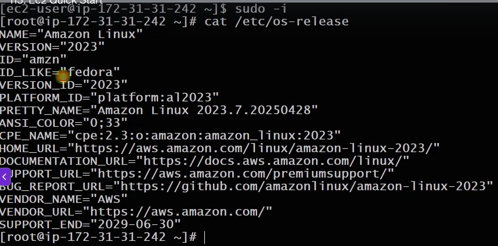

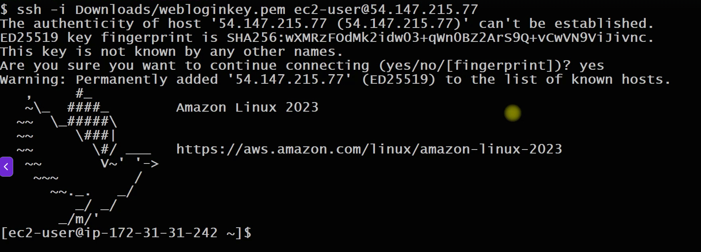

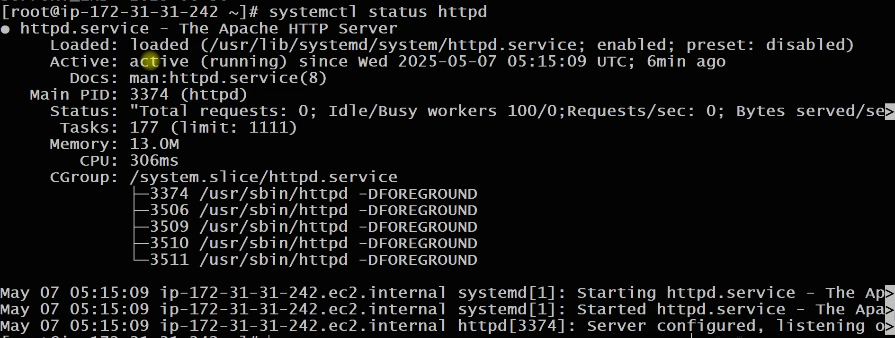

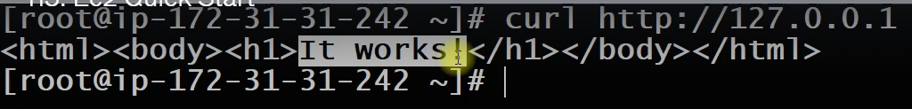

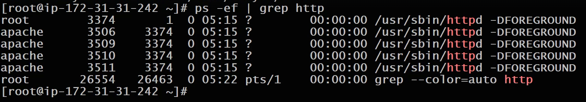

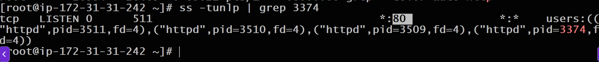

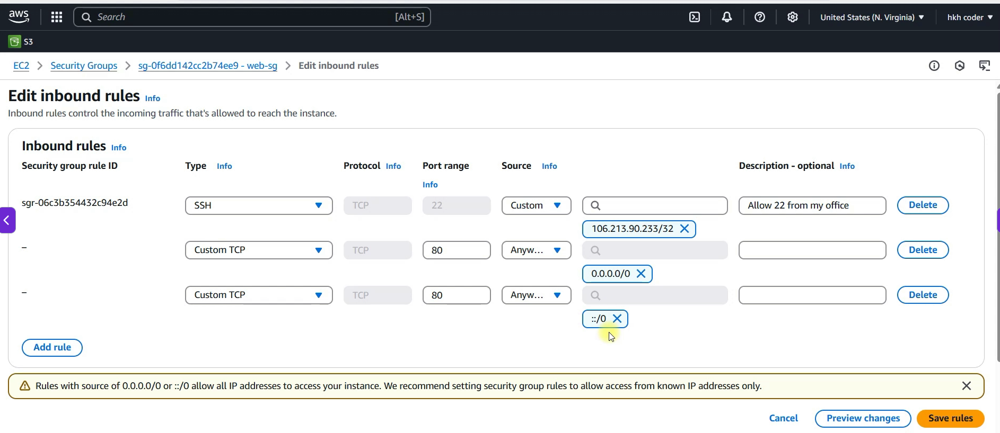

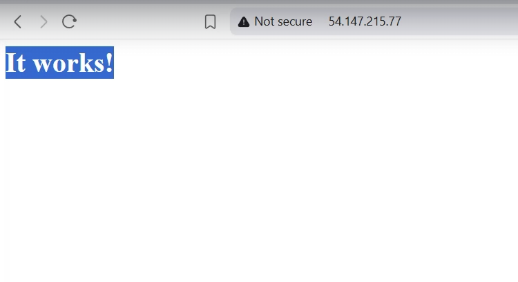

## Pricing

1. On Demand
    - Pay per hour or seconds.
2. Reserved
    - Reserve Capacity(1 or 3 yrs) for discounts.
3. Spot
    - Bid your price for unused ec2 capacity.
3. Dedicated Hosts
    - Physical Server dedicated for me

## EC2 Instance Creation

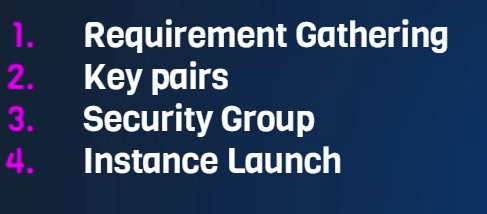

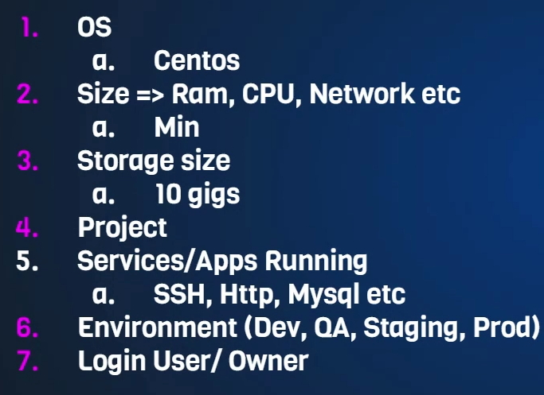

## Security Group

-  A security group acts as a virtual firewall that controls the traffic for one or more instances.
- You can add rules to each security group that allow traffic to or from its associated instances
- Security groups are "stateful". 

> **firewall** is a network security system that incoming and outgoing network traffic.

- **Inbound** : Traffic coming from outside on the Instance
- **Outbound**: Traffic going from Instance to outside 

## Installing Apache2 on Ubuntu EC2 Instance

```sh
sudo apt update
sudo apt install apache2 wget unzip -y
wget https://www.tooplate.com/zip-templates/2128_tween_agency.zip
unzip 2128_tween_agency.zip
sudo cp -r 2128_tween_agency/* /var/www/html/
sudo systemctl restart apache2
```
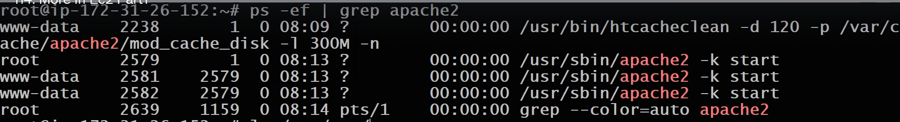

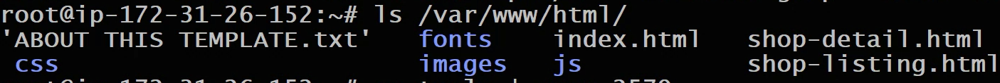

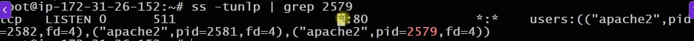

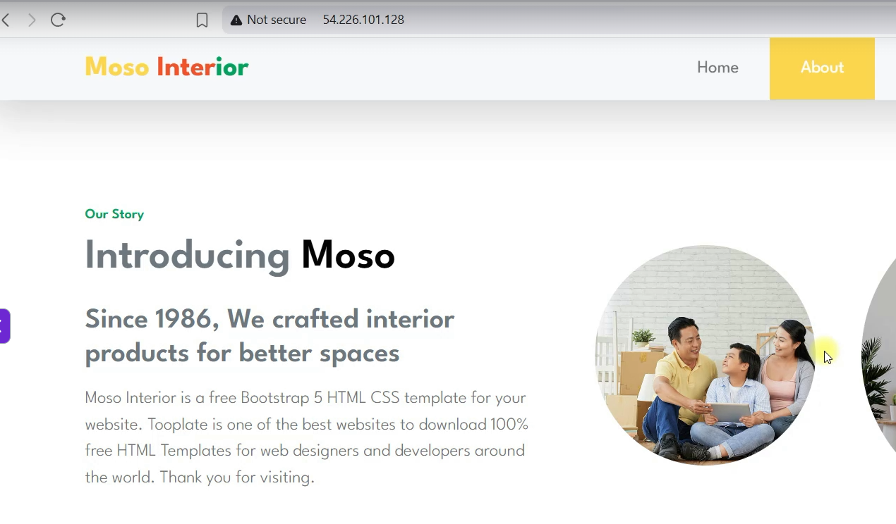

## Elastic IP Address

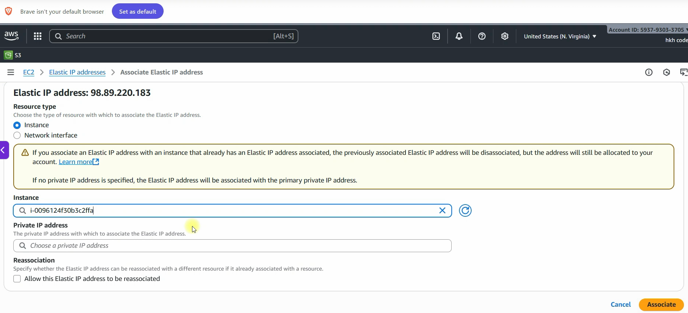

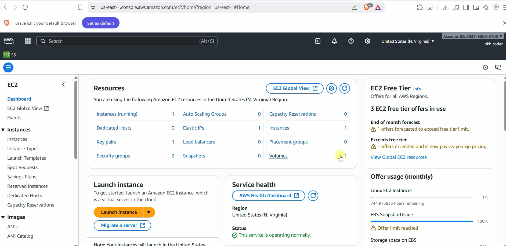

## Instance Type

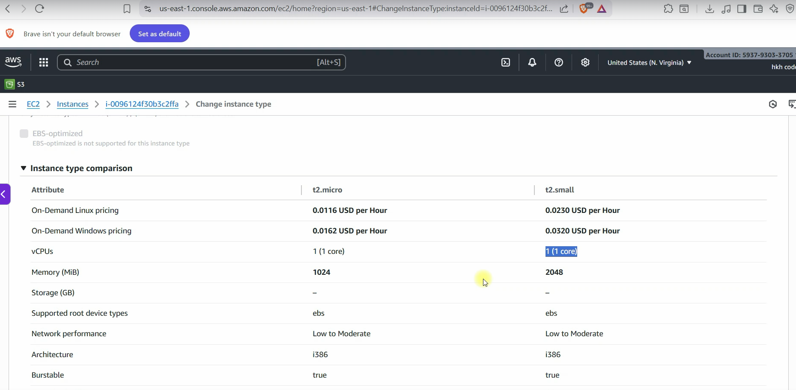

##

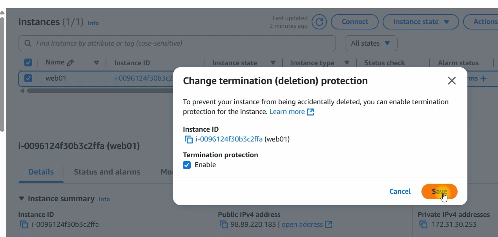

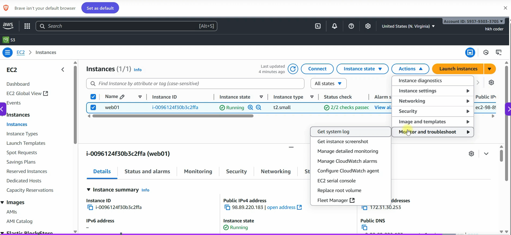

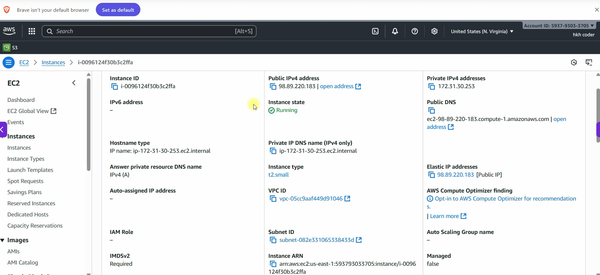


