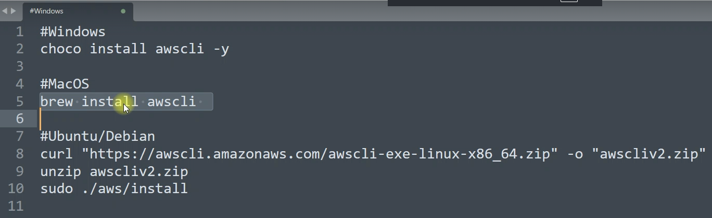
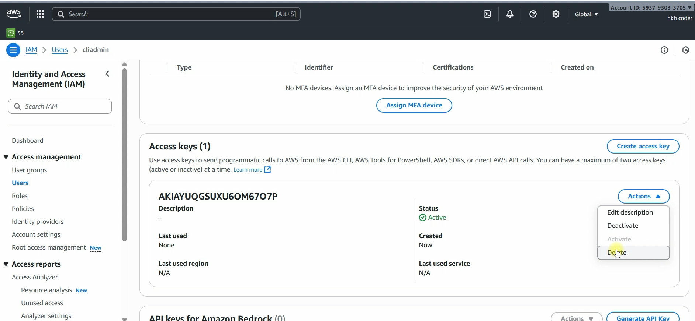
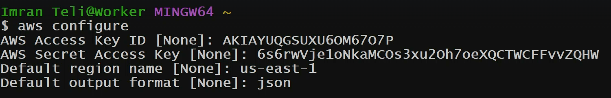
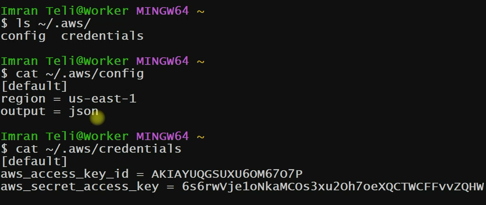

# AWS CLI

## URL

> AWS CLI Documentatiopn:
    - https://docs.aws.amazon.com/cli/latest/userguide/cli-chap-welcome.html

The **AWS Command Line Interface (AWS CLI)** is a unified tool that provides a consistent interface for interacting with all parts of Amazon Web Services. 
AWS CLI commands for different services are covered in the accompanying user guide, including descriptions, syntax, and usage examples.

## Install awscli

- Open Powershell as administrator










```sh
$ aws sts get-caller-identity
{
    "UserId": "AIDARJE**********GQLGHTXZ",
    "Account": "088354478627",
    "Arn": "arn:aws:iam::088********8627:user/terraform"
}

```

## AWS CLI Commands

- URL: https://docs.aws.amazon.com/cli/latest/userguide/cli-chap-welcome.html

- Amazon EC2
- Amazon EC2 Key Pairs
- Amazon EC2 Security Groups
- EC2 Instances
- Change EC2 type with bash scripting

### Amazon EC2

> Get Information about EC2 Instances 

```sh
aws ec2 describe-instances
{
    "Reservations": []
}
```

### Amazon EC2 Key Pairs

> On Windows: How to create key pair using AWS CLI

```sh
aws ec2 create-key-pair \
    --key-name MyKeyPair \
    --query 'KeyMaterial' \
    --output text > MyKeyPair.pem

aws ec2 create-key-pair --key-name MyKeyPair --query 'KeyMaterial' --output text > MyKeyPair.pem

$ ll
-rw-r--r-- 1 tchat 197609    1706 Sep 29 13:02 MyKeyPair.pem
```

### Amazon EC2 Security Groups

> Amazon Q: Create a security group with name mysg with rule 22 from myip and 80 anywhere

- Step 1: Get my Public IP
- Step 2: Get my Default VPC ID
- Step 3: Create the Security Group
- Step 4: Add Inbound Rules
    - Rule 1 — SSH (Port 22) from your IP only:
    - Rule 2 — HTTP (Port 80) from anywhere:
- All-in-One Script (Linux / macOS)
- Verify the Rules

```sh
# 1 ---------------------------------------------------------------------------------------------
MY_IP=$(curl -s https://checkip.amazonaws.com)
echo $MY_IP
# 138.89.63.208
# 2 ---------------------------------------------------------------------------------------------
VPC_ID=$(aws ec2 describe-vpcs \
    --filters "Name=isDefault,Values=true" \
    --query "Vpcs[0].VpcId" \
    --output text)
echo $VPC_ID
# vpc-0790cb94ce747f4db
# 3 ---------------------------------------------------------------------------------------------

# Create a new security group in the specified VPC.
# The command returns the Security Group ID.
SG_ID=$(aws ec2 create-security-group \
    --group-name mysg \                  
    --description "Security group with SSH from my IP and HTTP from anywhere" \  # Description
    --vpc-id $VPC_ID \                   
    --query 'GroupId' \                  # Extract only the GroupId from the JSON response
    --output text)                       # Display the result as plain text
# Print the Security Group ID to the terminal
echo $SG_ID
#
SG_ID=$(aws ec2 create-security-group \
    --group-name mysg \
    --description "Security group with SSH from my IP and HTTP from anywhere" \
    --vpc-id "$VPC_ID" \
    --query 'GroupId' \
    --output text)

#
SG_ID=$(aws ec2 create-security-group --group-name mysg --description "Security group with SSH from my IP and HTTP from anywhere" --vpc-id "$VPC_ID" --query 'GroupId' --output text)

echo "$SG_ID"
# sg-0eef8d9a9406d28a2

# 4.1 ---------------------------------------------------------------------------------------------
aws ec2 authorize-security-group-ingress \
    --group-id $SG_ID \
    --protocol tcp \
    --port 22 \
    --cidr ${MY_IP}/32
```

```output
{
    "Return": true,
    "SecurityGroupRules": [
        {
            "SecurityGroupRuleId": "sgr-0409dcc894d3e293d",
            "GroupId": "sg-0eef8d9a9406d28a2",
            "GroupOwnerId": "088354478627",
            "IsEgress": false,
            "IpProtocol": "tcp",
            "FromPort": 22,
            "ToPort": 22,
            "CidrIpv4": "138.89.63.208/32",
            "SecurityGroupRuleArn": "arn:aws:ec2:us-east-2:088354478627:security-group-rule/sgr-0409dcc894d3e293d"
        }
    ]
}

```

```sh

# 4.2 ---------------------------------------------------------------------------------------------
# Get your public IP
MY_IP=$(curl -s https://checkip.amazonaws.com)

# Get default VPC ID
VPC_ID=$(aws ec2 describe-vpcs \
    --filters "Name=isDefault,Values=true" \
    --query "Vpcs[0].VpcId" \
    --output text)

# Create security group
SG_ID=$(aws ec2 create-security-group \
    --group-name mysg \
    --description "Security group with SSH from my IP and HTTP from anywhere" \
    --vpc-id $VPC_ID \
    --query 'GroupId' \
    --output text)

# Add SSH rule from your IP only
aws ec2 authorize-security-group-ingress \
    --group-id $SG_ID \
    --protocol tcp \
    --port 22 \
    --cidr ${MY_IP}/32

# Add HTTP rule open to anywhere
aws ec2 authorize-security-group-ingress \
    --group-id $SG_ID \
    --protocol tcp \
    --port 80 \
    --cidr 0.0.0.0/0

echo "Security group $SG_ID created successfully!"
```

```output
$ aws ec2 authorize-security-group-ingress \
    --group-id $SG_ID \
    --protocol tcp \
    --port 80 \
    --cidr 0.0.0.0/0
{
    "Return": true,
    "SecurityGroupRules": [
        {
            "SecurityGroupRuleId": "sgr-0a70cfd304ca6c360",
            "GroupId": "sg-0eef8d9a9406d28a2",
            "GroupOwnerId": "088354478627",
            "IsEgress": false,
            "IpProtocol": "tcp",
            "FromPort": 80,
            "ToPort": 80,
            "CidrIpv4": "0.0.0.0/0",
            "SecurityGroupRuleArn": "arn:aws:ec2:us-east-2:088354478627:security-group-rule/sgr-0a70cfd304ca6c360"
        }
    ]
}
#
$ echo "Security group $SG_ID created successfully!"
Security group sg-0eef8d9a9406d28a2 created successfully!
```

### EC2 Instances

To launch an Amazon EC2 instance using the AMI I selected, use the aws ec2 run-instances command. 
I can launch the instance into a **virtual private cloud (VPC)**.

Initially, my instance appears in the pending state, but changes to the running state after a few minutes.

The following example shows how to launch a **t2.micro** instance in the **specified subnet of a VPC**. Replace the italicized parameter values with your own.

```sh
aws ec2 run-instances --image-id ami-xxxxxxxx --count 1 --instance-type t2.micro --key-name MyKeyPair --security-group-ids sg-903004f8 --subnet-id subnet-6e7f829e
```

> Launch EC2 instance with aws cli with below details:
1. Name: web01
2. Key pair: MyKeyPair
3. Security Group: mysg
4. AMI: ami-04b3f3bf99ec556c1
5. Instance type: t2.micro
6. Region: us-east-2

> Step 1: Get the Security Group ID for mysg
> Step 2: Get the Subnet ID from Default VPC
> Step 3: Launch the EC2 Instance
> Step 4: Verify the Instance is Running
> Step 5: Wait Until Instance is Running
> Step 6: Get the Public IP to SSH

```sh
# 1 ---------------------------------------------------------------------------------------------
SG_ID=$(aws ec2 describe-security-groups \
    --filters "Name=group-name,Values=mysg" \
    --query "SecurityGroups[0].GroupId" \
    --output text \
    --region us-east-2)

echo $SG_ID

# 2 ---------------------------------------------------------------------------------------------
SUBNET_ID=$(aws ec2 describe-subnets \
    --filters "Name=defaultForAz,Values=true" \
    --query "Subnets[0].SubnetId" \
    --output text \
    --region us-east-2)

echo $SUBNET_ID

# 3 ---------------------------------------------------------------------------------------------
aws ec2 run-instances \
    --image-id ami-04b3f3bf99ec556c1 \
    --instance-type t2.micro \
    --key-name MyKeyPair \
    --security-group-ids $SG_ID \
    --subnet-id $SUBNET_ID \
    --tag-specifications 'ResourceType=instance,Tags=[{Key=Name,Value=web01}]' \
    --region us-east-2

# 4 ---------------------------------------------------------------------------------------------
aws ec2 wait instance-running \
    --instance-ids $INSTANCE_ID \
    --region us-east-2

echo "Instance $INSTANCE_ID is now running!"

# 5 ---------------------------------------------------------------------------------------------
aws ec2 wait instance-running \
    --instance-ids $INSTANCE_ID \
    --region us-east-2

echo "Instance $INSTANCE_ID is now running!"

# 6 ---------------------------------------------------------------------------------------------
PUBLIC_IP=$(aws ec2 describe-instances \
    --instance-ids $INSTANCE_ID \
    --query "Reservations[0].Instances[0].PublicIpAddress" \
    --output text \
    --region us-east-2)

echo "Connect using: ssh -i MyKeyPair.pem ec2-user@$PUBLIC_IP"

```

### Change EC2 type with bash scripting

```sh
$ aws ec2 describe-instances
```

```sh
aws ec2 describe-instances \
    --query "Reservations[*].Instances[*].{Name:Tags[?Key=='Name']|[0].Value,InstanceId:InstanceId,State:State.Name,Type:InstanceType,PublicIP:PublicIpAddress,PrivateIP:PrivateIpAddress}" \
    --output table \
    --region us-east-2
```

```output
-------------------------------------------------------------------------------------
|                                 DescribeInstances                                 |
+----------------------+--------+------------+-----------+-------------+------------+
|      InstanceId      | Name   | PrivateIP  | PublicIP  |    State    |   Type     |
+----------------------+--------+------------+-----------+-------------+------------+
|  i-09c8c88e5310ca534 |  web02 |  None      |  None     |  terminated |  t2.micro  |
|  i-0d21774c7bca3d3dc |  web01 |  None      |  None     |  terminated |  t2.micro  |
+----------------------+--------+------------+-----------+-------------+------------+

```