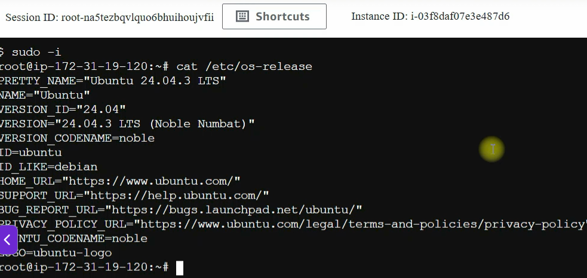
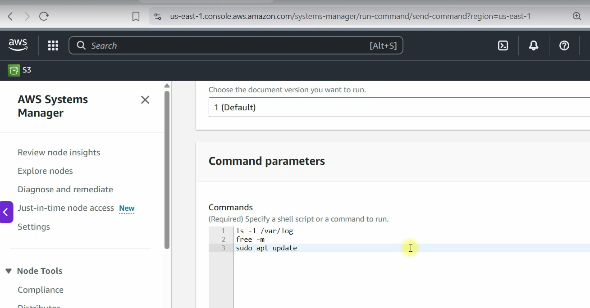

# SSM & CloudShell

In AWS, **SSM** stands for **Systems Manager**.

**AWS Systems Manager (SSM)** is a service that helps me manage and automate operations across my AWS resources, especially EC2 instances and hybrid environments.

Some common SSM features include:

- **Session Manager:** Securely connect to EC2 instances without SSH keys or opening port 22.
- **Parameter Store:** Store configuration values, passwords, API keys, and secrets.
- **Run Command:** Execute commands on multiple instances remotely.
- **Patch Manager:** Automate operating system patching.
- **Automation:** Automate common maintenance and operational tasks.
- **Inventory:** Collect metadata about my managed instances.

## URL:

- https://docs.aws.amazon.com/systems-manager/latest/userguide/what-is-systems-manager.html 

## Launch an EC2 instance (Ubuntu OS)
```
Create an EC2 Instanmce from AWS GUI
└── Search and choose EC2
    └── Launch Instance
    │   ├── Choose a region 
    │   ├── Name and Tags
    │   │    └── Name: Server1
    │   │ 
    │   ├── Application and OS Images (AMI)
    │   │    ├── Choose the AMI as Ubuntu Server 24.04 LTS - Free Tier
    │   │    └── Choose Instance Type: t2.micro
    │   │    
    │   ├── Key Pair: select an existing one
    │   │    
    │   └── Network Settings
    │        └── Security Group: selecting an existing one
    │   
    └── Launch Instance      
```

## Connect EC2 Instance from AWS SSM

The goal here is one service who want to connect to another service

```sh
Go to IAM Service
└── Roles 
    │   └──  Create role
    │ 
    ├── Select trusted entity
    │   ├── Trusted entity type: AWS service
    │   ├── Use case: EC2
    │   └── Next
    │   
    ├── Add Permissions
    │   └── Permissions policies
    │       ├── search and select AmazonSSMManagerdInstanceCore
    │       └── Next
    │   
    ├── Name, review, and create
    │   └── Role details
    │       ├── Role name: `SSMManagerdInstanceCore`
    │       └── Description: Allow EC2 instance to call AWS services on my behalf
    │       
    └── Create role
```

## Attached the role to my instance

```sh
Go to EC2 Service
└── Actions 
    │   ├── Security
    │   └──  Modify IAM role
    │ 
    └── Modify IAM role
        └── IAM role
            ├── Search and select `SSMManagerdInstanceCore`
            └── Update IAM role+
```

## Access EC2 from the SSM

```sh
Go to AWS System manger service
└── Go to Session manager 
    │   └── Click on `Start session`
    │   
    ├── Reason
    │   └── seach `ShellAccess`
    ├── Target instances
    │   ├── seach and select my EC2 instance based on his name `Server1`
    │   └── Next
    │   
    ├── Next
    │   
    └── Start Session
```

Now I hace acce to a terminbal where i can execute my commands



## Run Command

```sh
At AWS Systems Manager select `Run Command`
└── Go to  Run Command
       ├── Command document
       ├── Search and choose `RunShellScript` and select it
       ├── I can choose `Working directory`, optional
       ├── Base on `Tag Key` I can execute commands on the group of instances
       ├── ...
       └── run
```
At the end I can select the instance and view the oputput


