# Elastic Bloc Storage

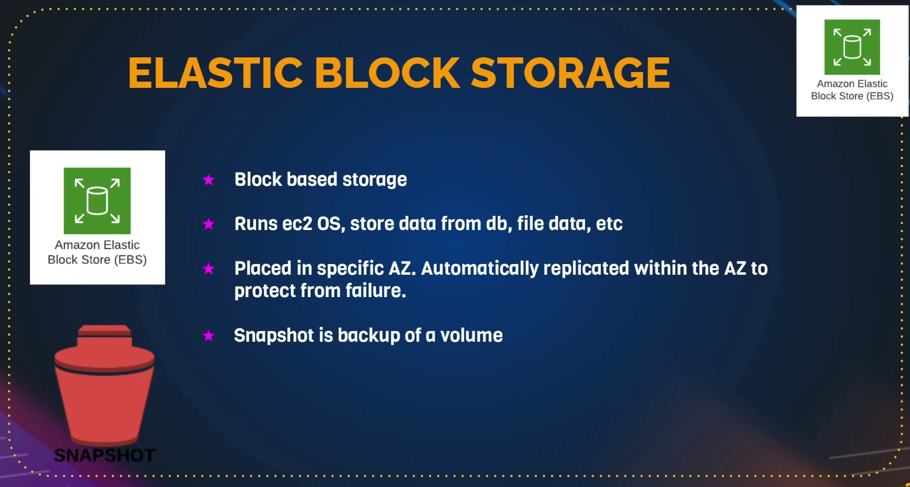

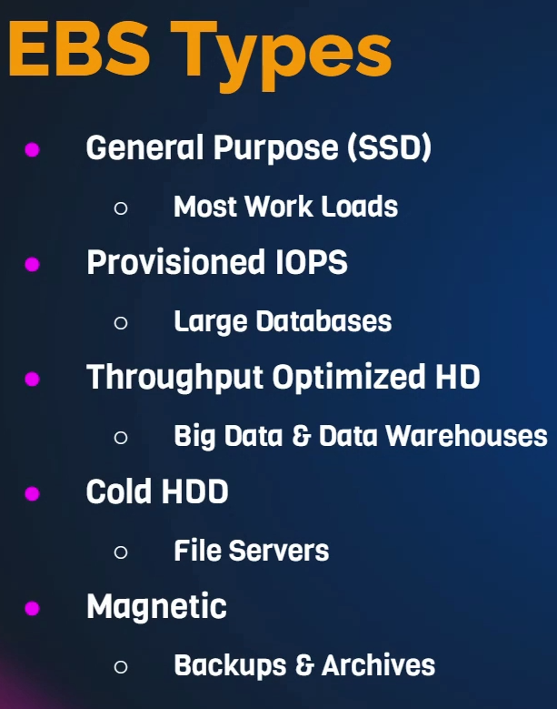

## Launch an EC2 instance (CentOSS)

```
Create an EC2 Instanmce from AWS GUI
└── Search and choose EC2
    └── Launch Instance
    │   ├── Choose a region 
    │   ├── Name and Tags
    │   │    └── Name: Server1
    │   │ 
    │   ├── Application and OS Images (AMI)
    │   │    ├── Choose the AMI as Am,azon Linux 2023 AMI - Free Tier
    │   │    └── Choose Instance Type: t2.micro
    │   │    
    │   ├── Key Pair: select an existing one
    │   │    
    │   ├── Network Settings
    │   │    └── Security Group: selecting an existing one
    │   │    
    │   └── Advanced details
    │       ├── Configure storage
    │       │   ├── By default: 8GB size volume and gp3 type volume
    │       │   ├── Based on the requirement I can modify it
    │       │   └── I'll keep default configuration for now
    │       │    
    │       └── User data
    │   
    └── Launch Instance      
```

> User data

```sh
#!/bin/bash
yum install httpd wget unzip -y
systemctl start httpd
systemctl enable httpd
cd /tmp
wget https://www.tooplate.com/zip-templates/2119_gymso_fitness.zip
unzip -o 2119_gymso_fitness.zip
cp -r 2119_gymso_fitness/* /var/www/html/
systemctl restart httpd
```

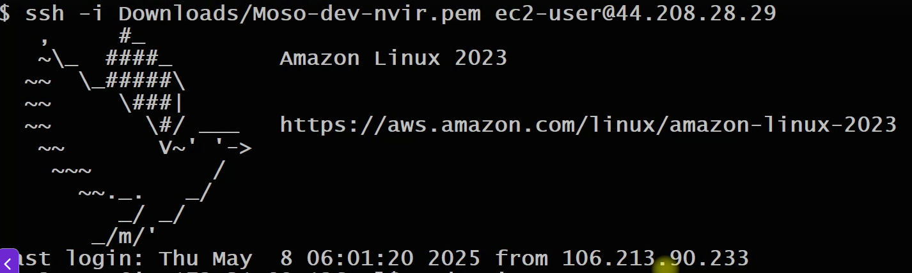

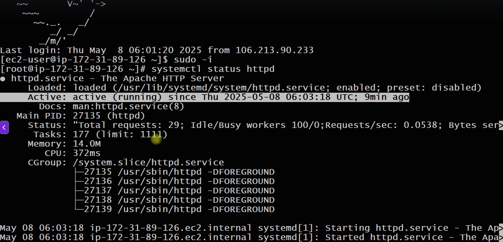

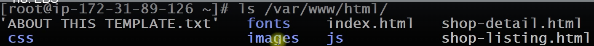

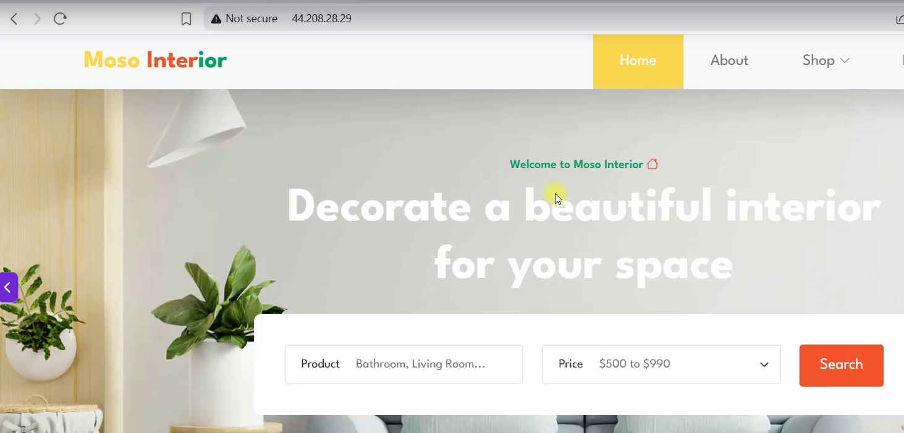

## To list all the available and connected hard disc

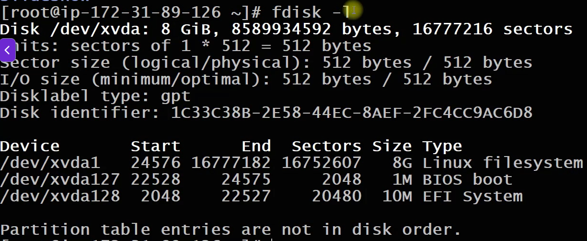

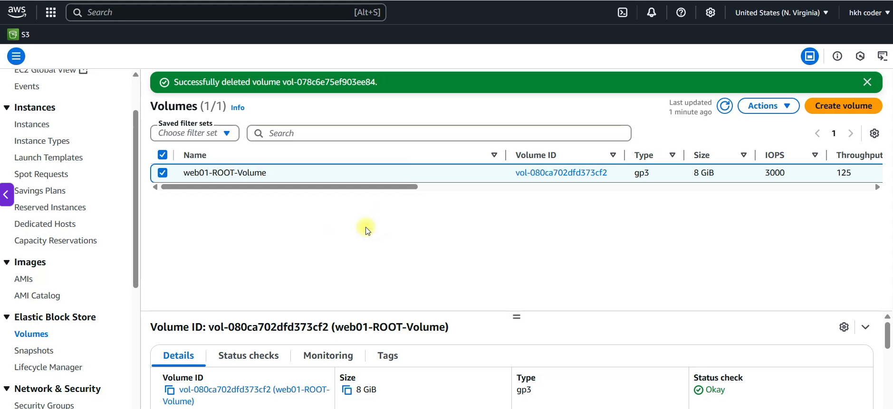

## Adding extras volume to store webserver data

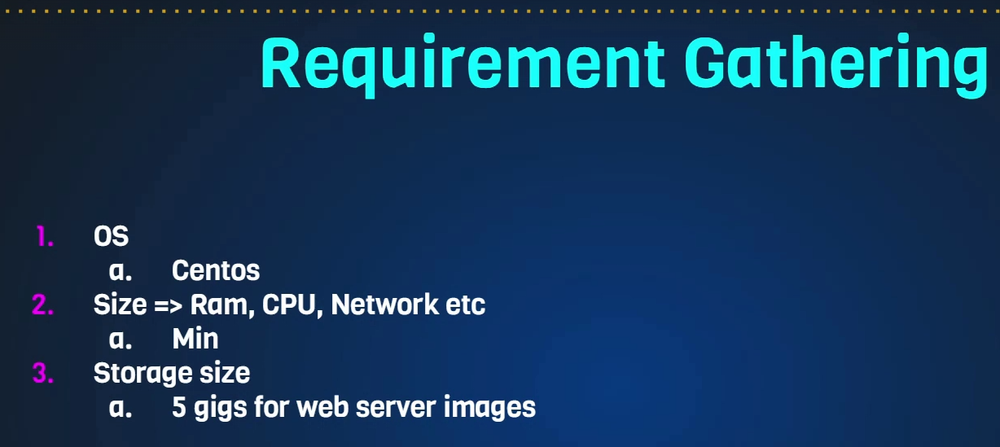

```sh
Go to Volumes and click on `Create volume`
└── Volume settings
    ├── Volume size
    │   └── 5GB
    ├── Availability zone
    │   └── us-east-1c "same AZ as EC2"
    ├── Encryption (If requir)
    │   └── Check encrypt this volume "I can use the default key or create my own key using KMS service" (ignore it)
    ├── Tags 
    │   ├── Key: Name
    │   └── Value: agt-web01-dev-images
    │    
    └── Create volume
```

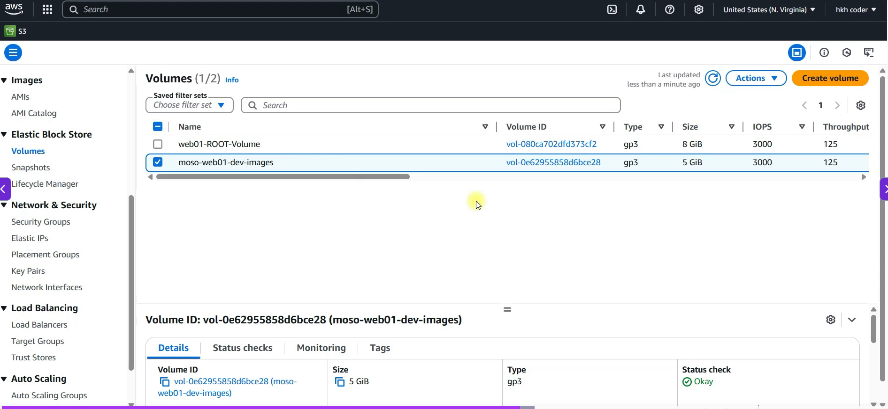

## Attached vole to an EC2

```
Go to Volumes and click on `Action` > `Attached volume`
└── Basic detail
    ├── Instance: seach and select it
    ├── Device name: seach and select `/dev/sdf` (doesn't matter system will rename it as well)
    │    
    └── Attached volume
```

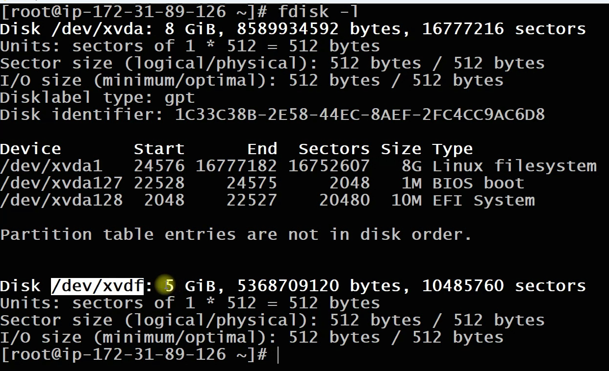

## Creating a partition from the new /dev/xvdf

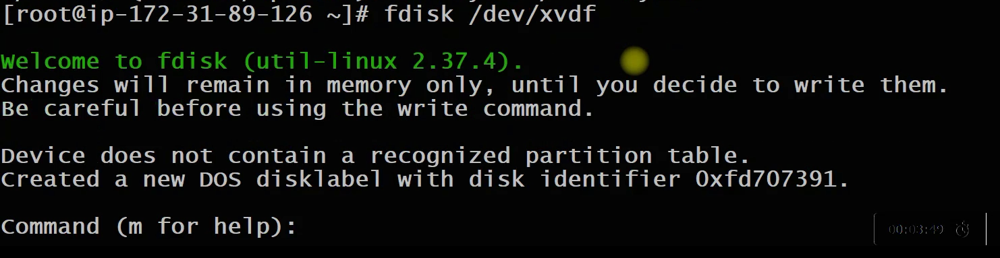

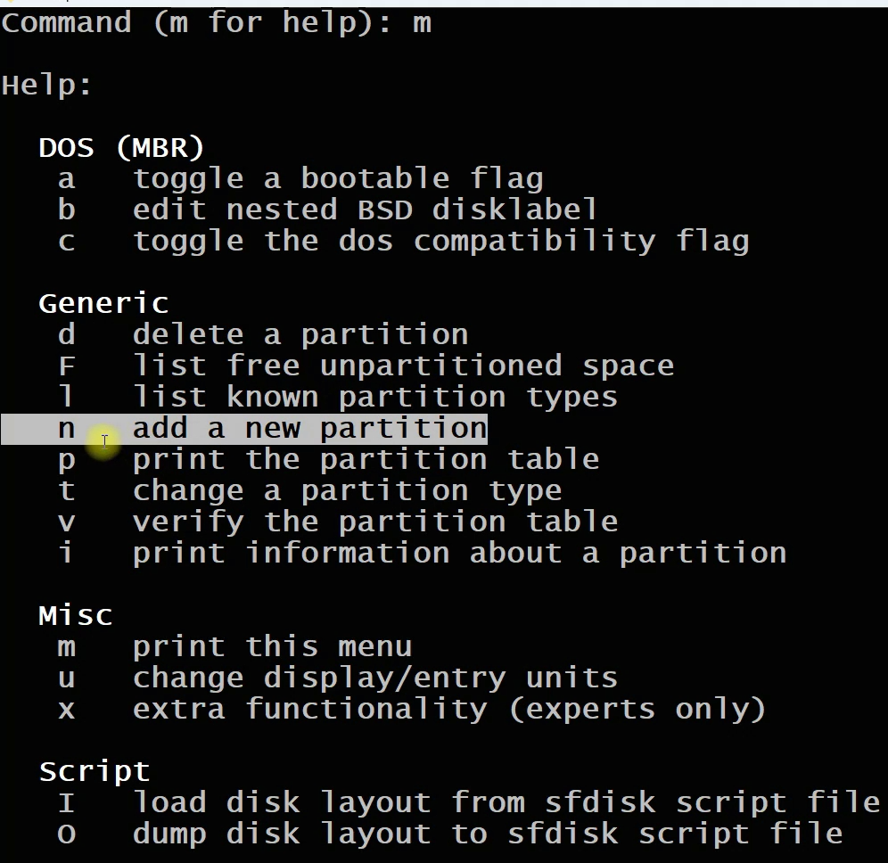

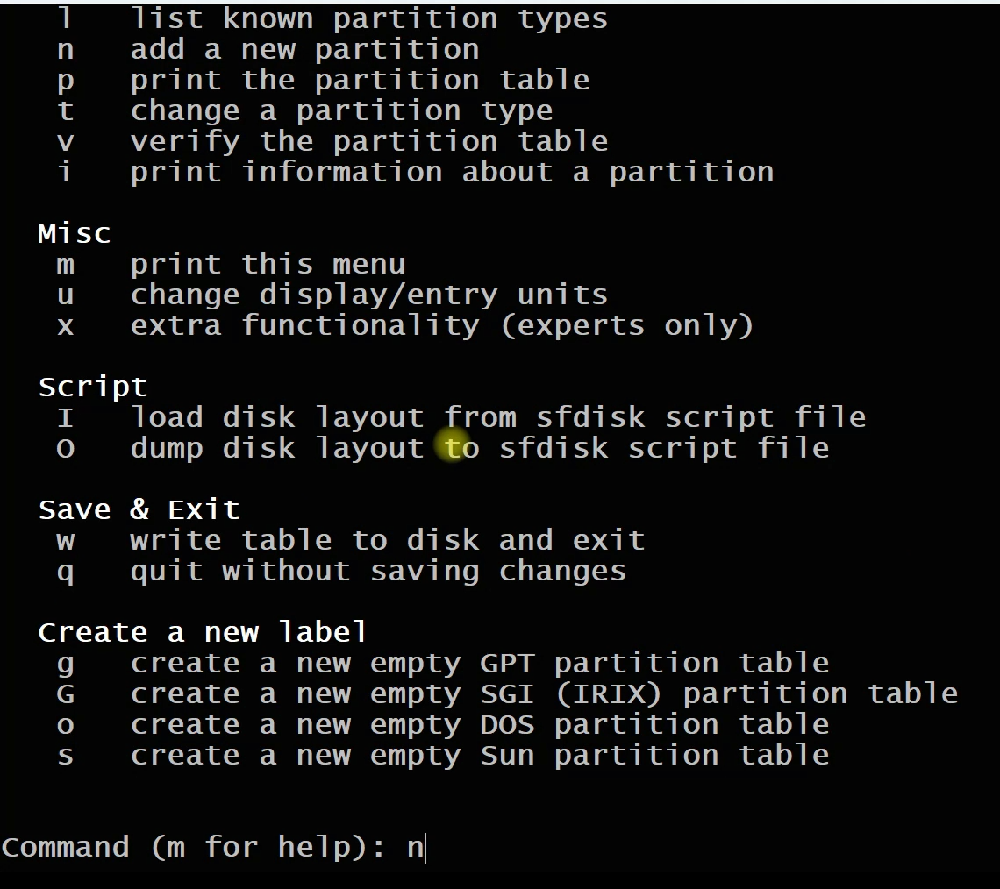

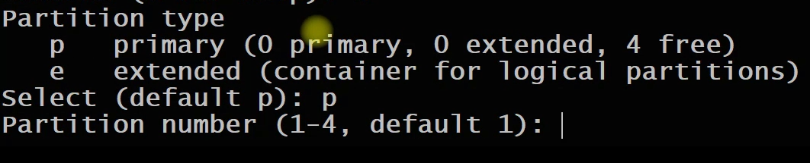

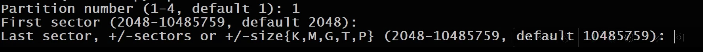

- Hit enter to use the entire disk partition
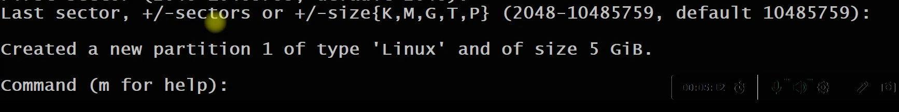

- Hit p to print
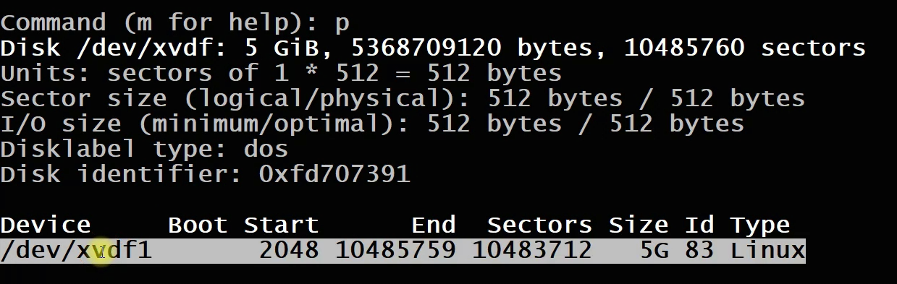

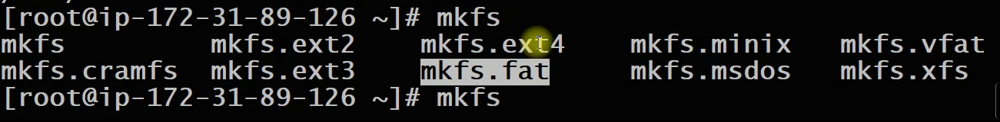

## Formatting the created partition

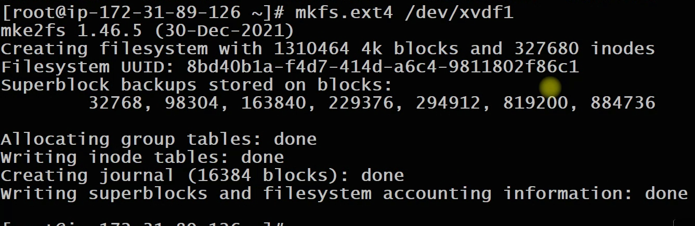

- Backup files in another directory first
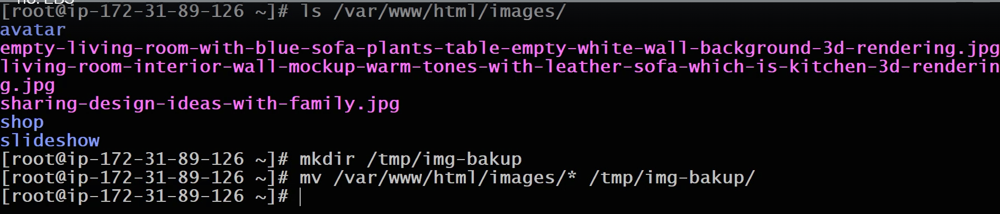

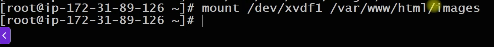

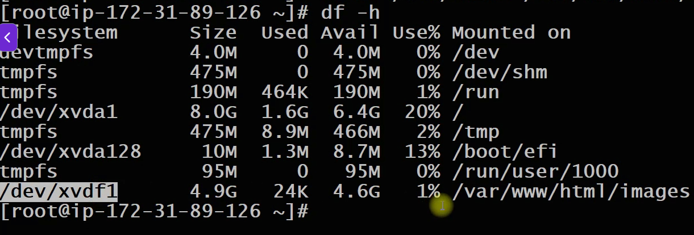

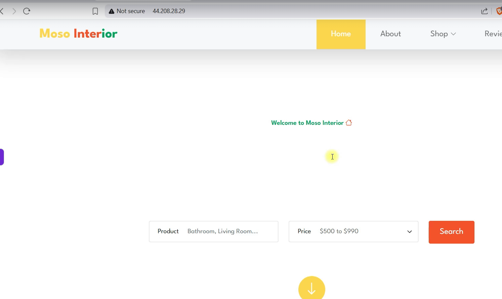

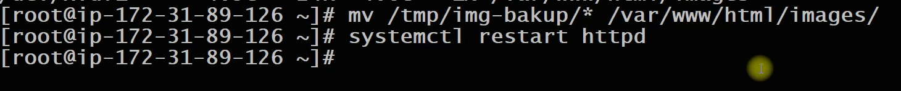


## To unmount the partition

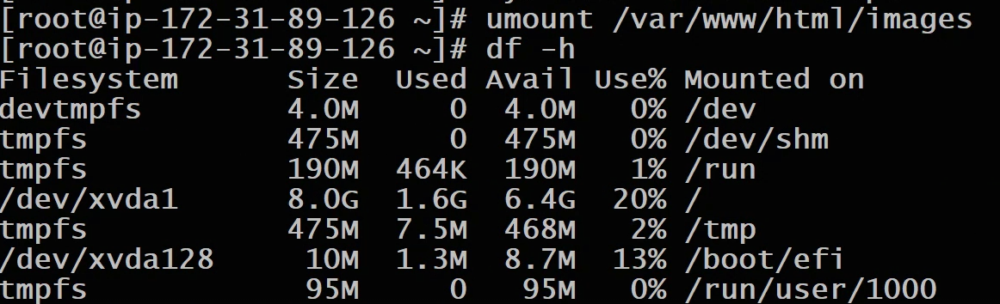

## The permanent mount

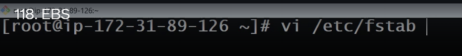

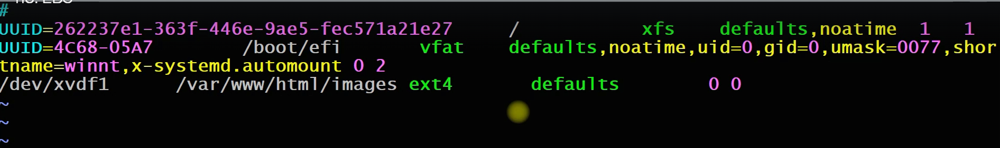


