# EBS Snapshots

Snapshots are backups of EBS volume

## Prerequisites

- EC2 Web01

Check my VM to see the extras volume

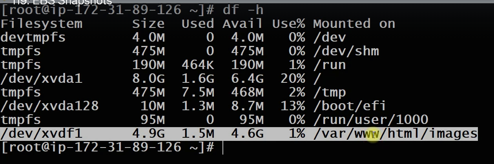

> Check the process using the directory

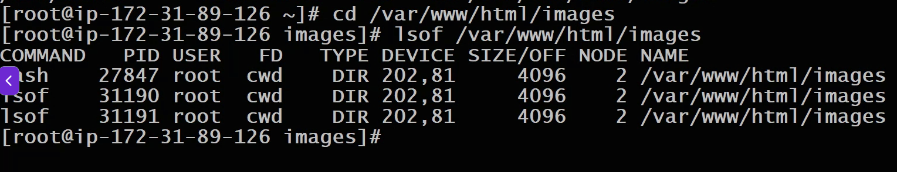

- Always kill running process before unmount the volume to free that directory

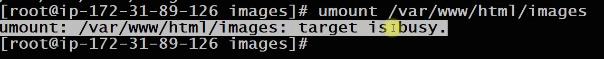

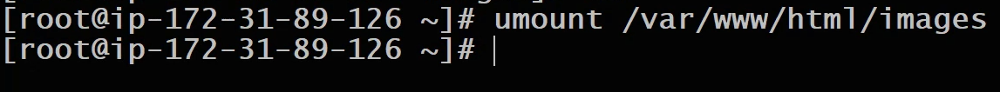

## Remove entry from /etc/fstab

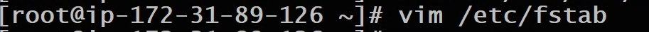

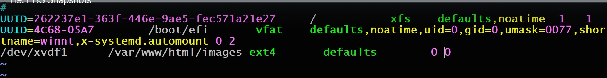

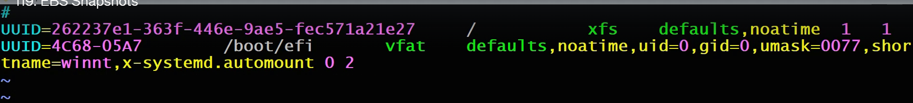

- Now detached the volume

```sh
Go to Volumes and click on `Action` > `Detached volume`
└── Detach
```

- Delete this volume

```sh
Go to Volumes and click on `Action` > `Delete volume`
└── Delete
```

## Create a new volume for MySQL DB

```sh
Go to Volumes and click on `Create volume`
└── Volume settings
    ├── Volume size
    │   └── 5GB
    ├── Availability zone
    │   └── us-east-1c "same AZ as EC2"
    ├── Encryption (If requir)
    │   └── Check encrypt this volume "I can use the default key or create my own key using KMS service" (ignore it)
    ├── Tags - optional > `Add tag`
    │   ├── Key: Name
    │   └── Value: db-01-mysql-vol
    │    
    └── Create volume
```

## Attached vole to an EC2

```sh
Go to Volumes and click on `Action` > `Attached volume`
└── Basic detail
    ├── Instance: seach and select it
    ├── Device name: seach and select `/dev/sdh` (doesn't matter system will rename it as well)
    │    
    └── Attached volume
```

Go back to the EC2 instance and rename it as db01

> ssh to the instance:

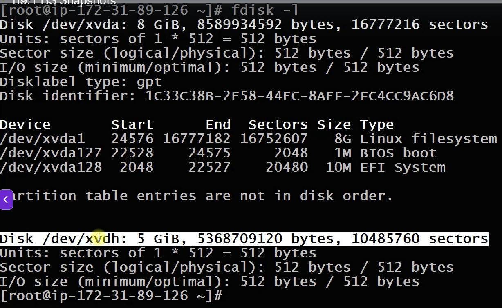

> Create the partition

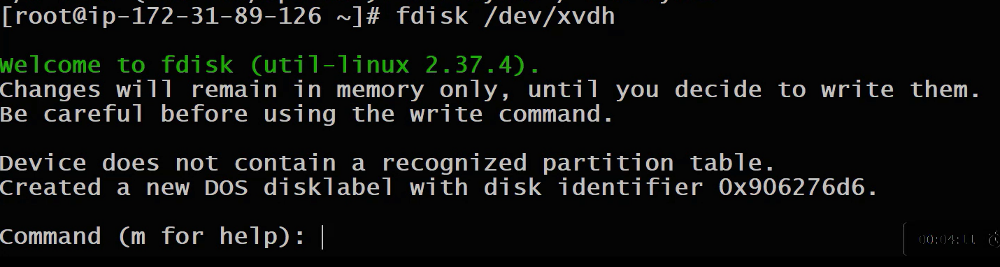

1. `n` to create a new partition
2. `p` for4 primary
3. `1` for partition number 1
4. press Enter for 1st sector
5. press Enter to go to the last sector
6. `w` to write

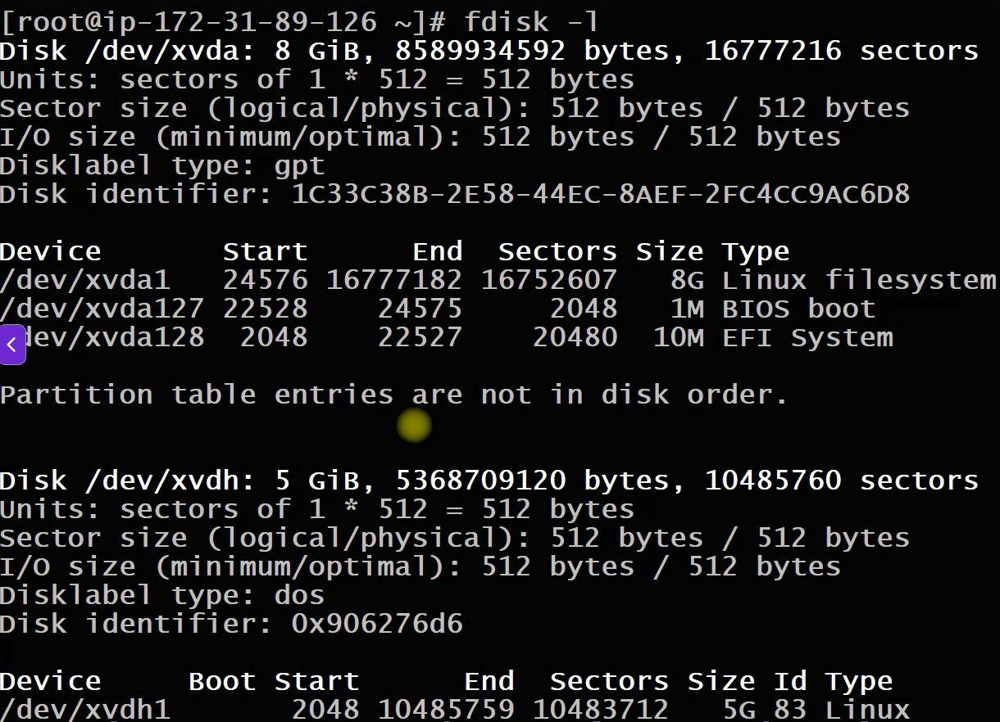

> Format the partition in xfs file

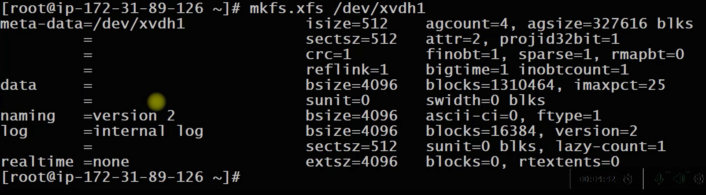

> Create and temporary mount the `/var/lib/mysql` folder for the mout volume

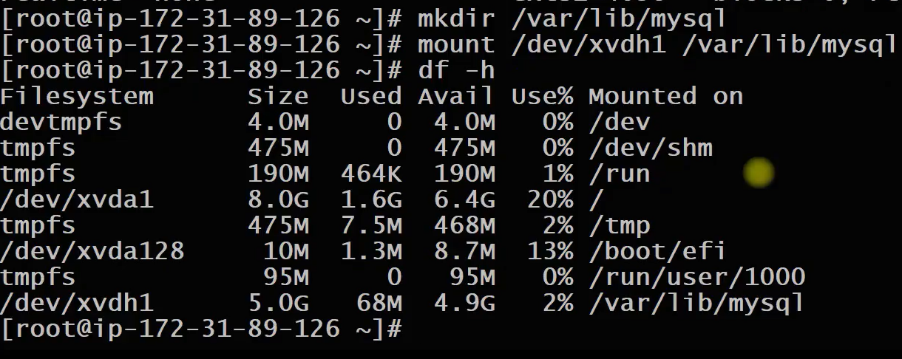


## Install the mariadb  server package

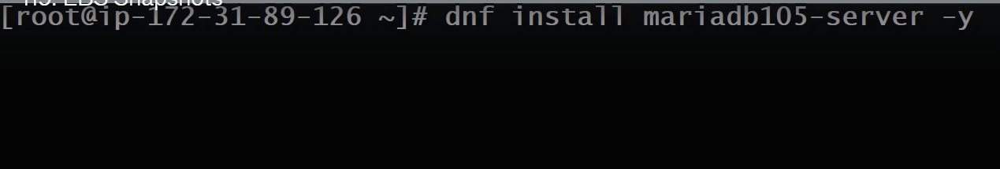

> start mariadb service

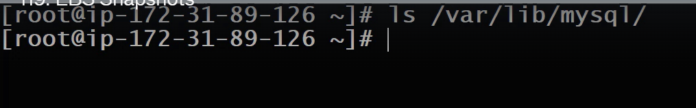

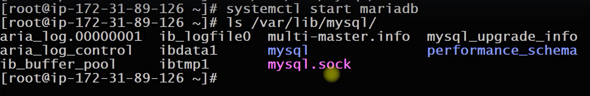

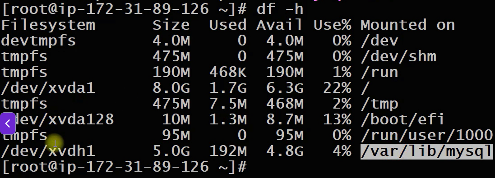

## Taking a snapshot

What happen if data lost 

I have to make a snapshot:
- The 1st snapshot will take all the data
- The following snapshots will tak only the incremental data

```sh
Go to Volumes and click on `Action` > select the require volume > `Create snapshot`
└── Snapshot details
    ├── Description: db01-mysql-snapshot
    ├── Tags
    │   └──  Add tag
    │       ├──  Key: Name
    │       └──  Value - optional: db01-mysql-snapshot
    │    
    └── Create snapshot
```

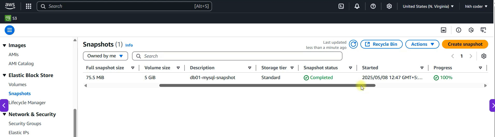

> Remove data (corrupted) from the volume and restart the mariadb service (we will have a error saying data is missing)
> Our snapshot volume is ready

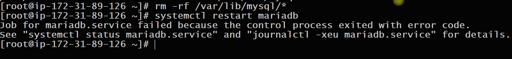

> Deatch the volume

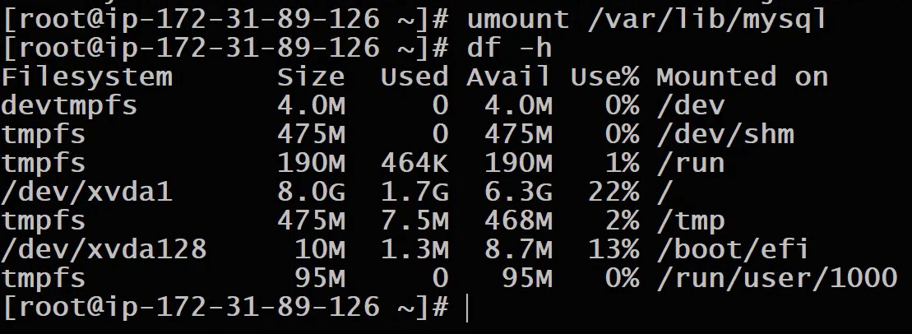

> rename this volume as corrupted

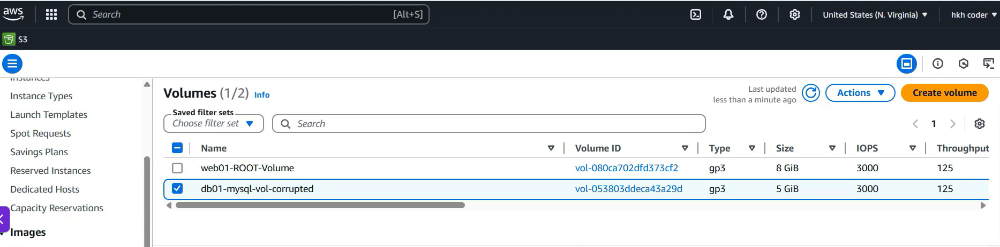

## Creating a new volume fom the snapshot

```sh
Go to Snapshots and click on `Action` > select the require volume > `Create volume from snapshot`
└── Volume settings
    ├── Volume type: db01-mysql-snapshot
    │   └── I can change volume type > 
    ├── Size
    │   └──  5Gb
    │   
    ├── Availability zone
    │   └──  I can also change the AZ based on my requiremet (keep a same zone here): us-east-1c
    │   
    ├── I can encrypot it
    │   
    ├── Tag
    │   └──  Add tag
    │       ├──  Key: Name
    │       └──  Value - optional: db01-mysql-vol-recovered
    │   
    └── Create snapshot
```

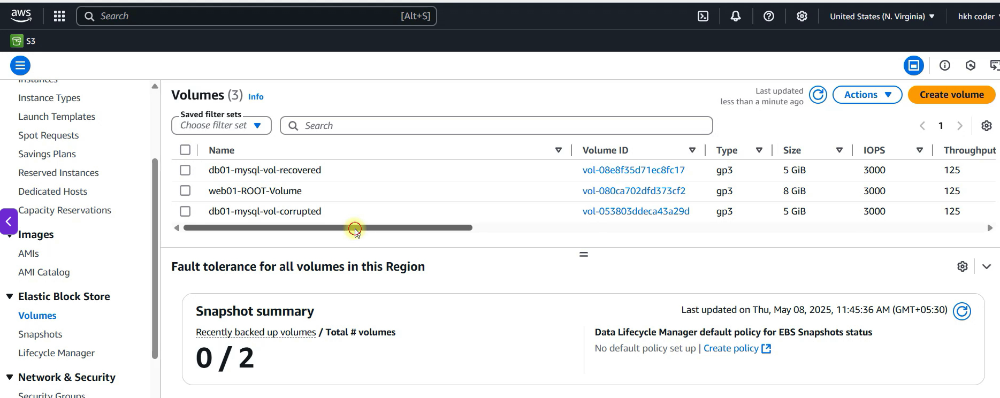

Now i can detached and delete the corrupted volume

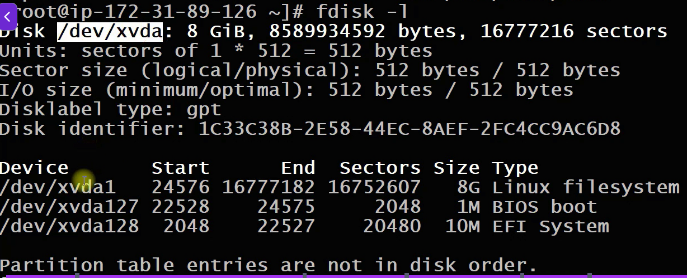


> Now I can attached the recovered volume from the AWS Console

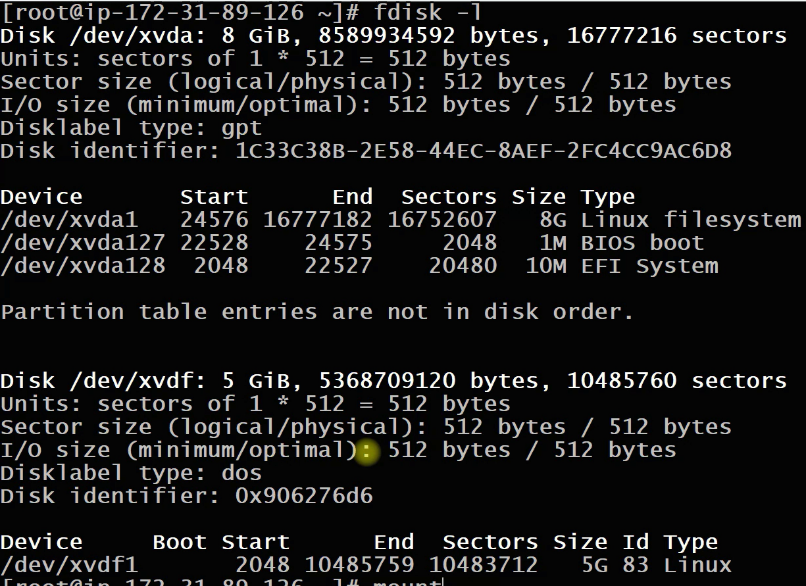

> L:ets mount it and check

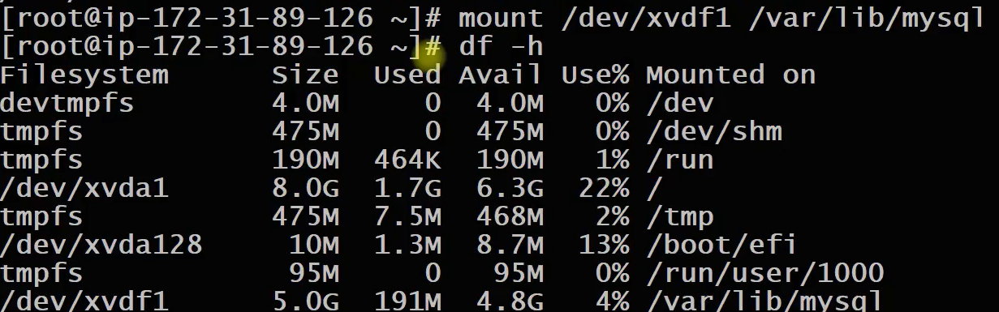

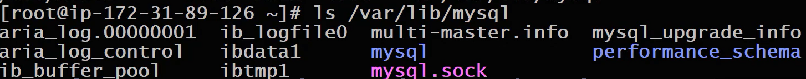

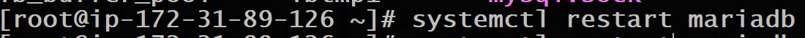

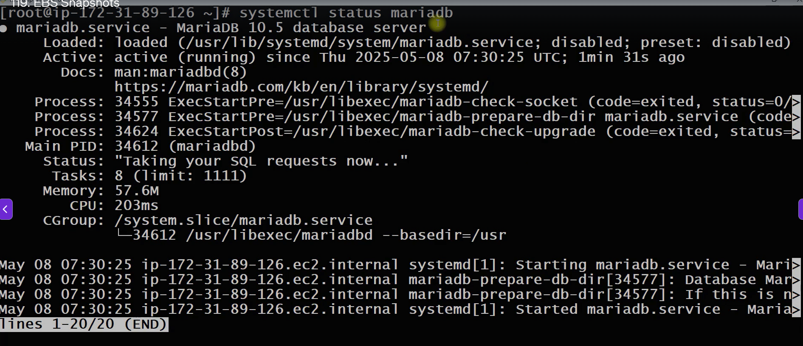

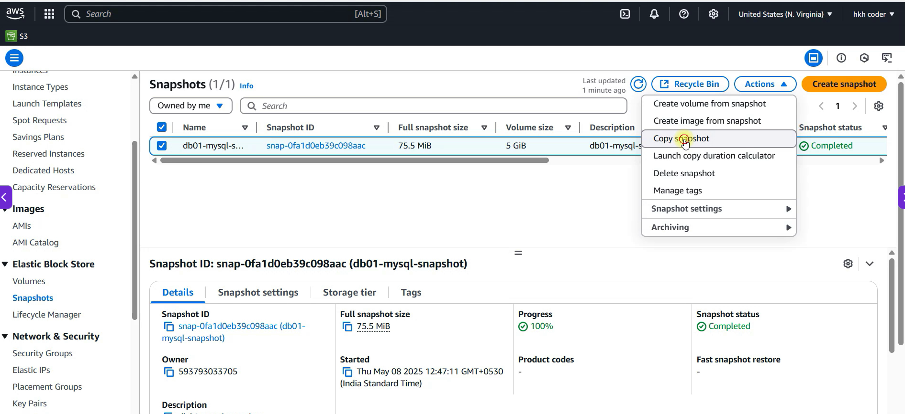

- To move data from differenmts region is made by the snapshot


## Modify permission on the snapshot

```sh
Go to Snapshots and click on `Action` > select the require volume > `Snapshot settings` > `Modify permissions`
└── Modify permissions 
    ├── settings
    │   └── I can make a snapshot public
    └── Shared accounts
        └──  or I can share a snapshot with differents aws account
            └── Add account
                └── Account ID > Enter Account ID
                    └── Add > The snapshot shoul be available in the others aws account 
```


