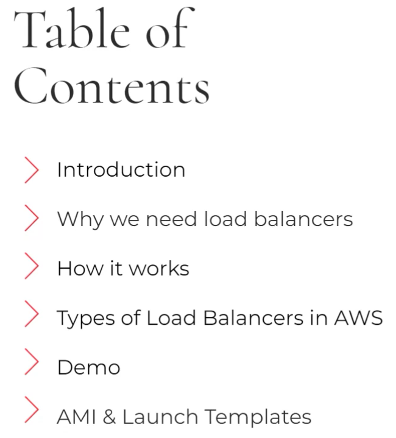
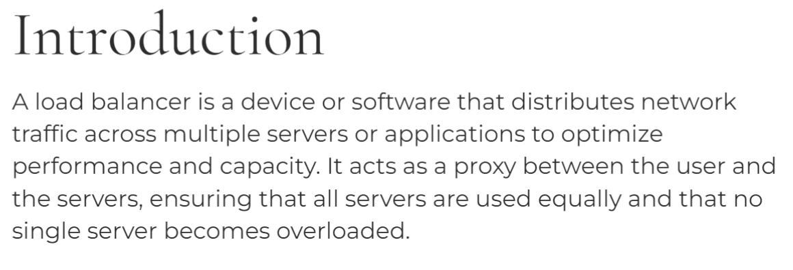
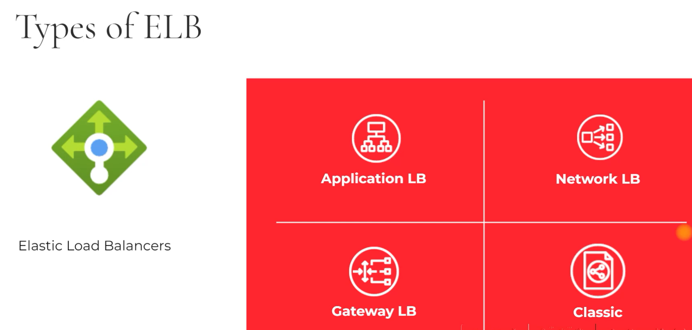
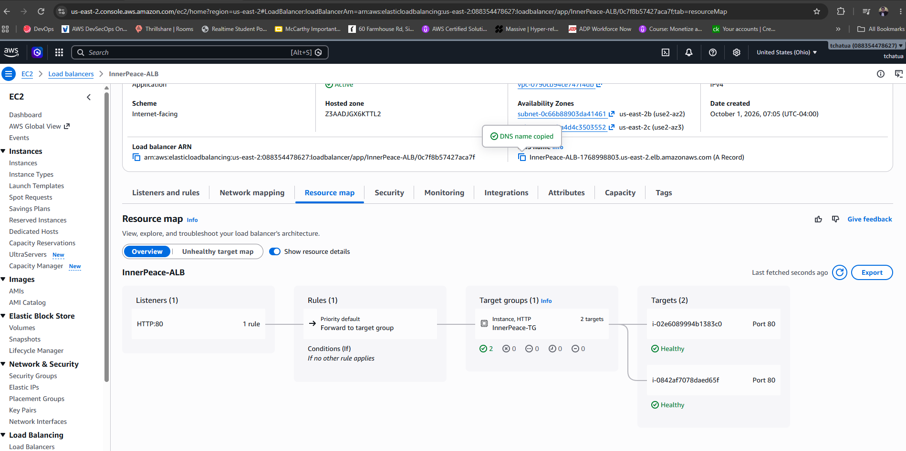

# AWS EBS: Elastic Load Balancer

## Documentation

- https://docs.aws.amazon.com/elasticloadbalancing/

# Elastic Load Balancer

- Create ans AMI image
- Create Launch Template 
- Target Group
- Load Balancer

