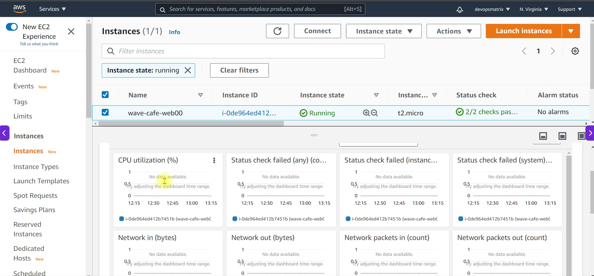
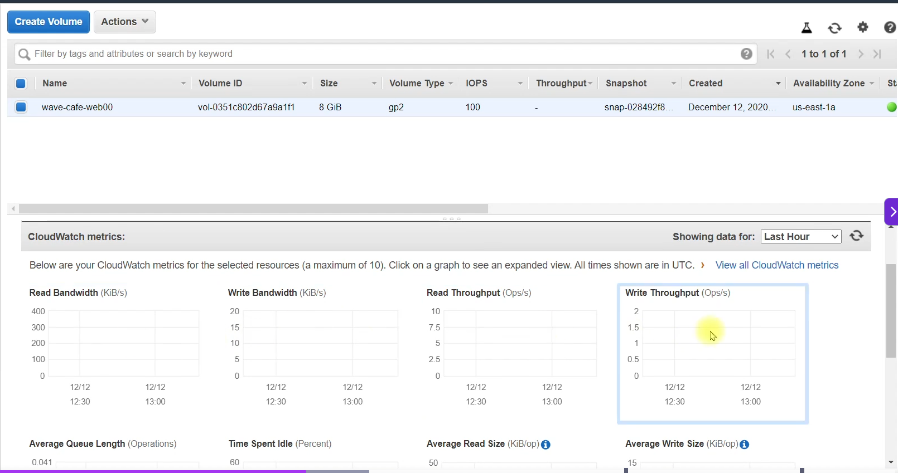
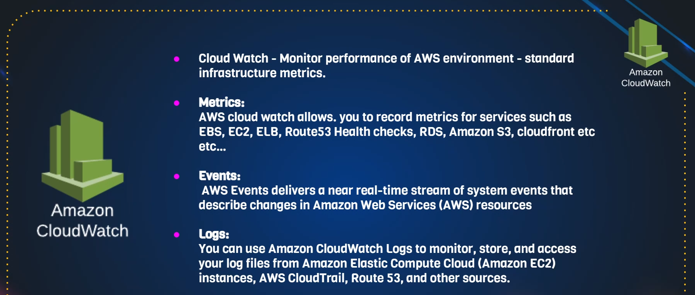
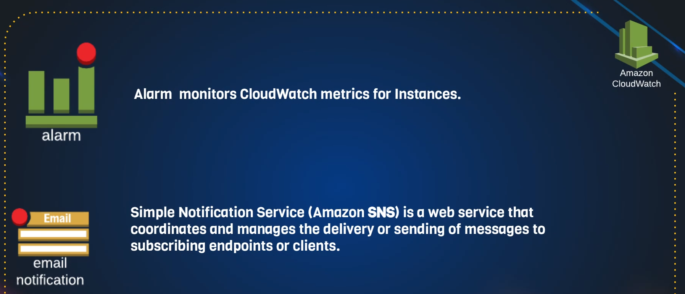
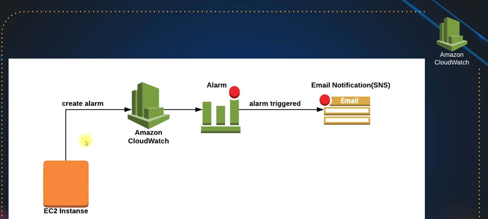
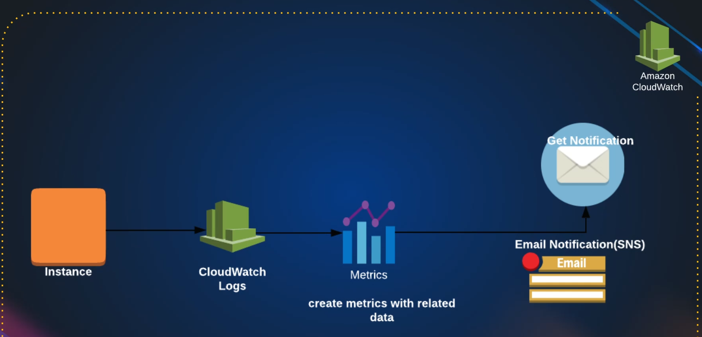
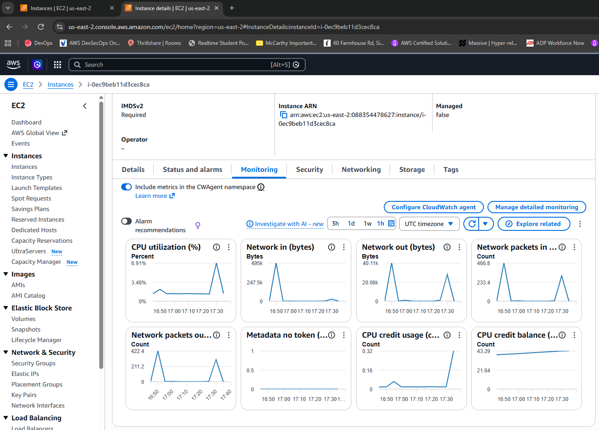
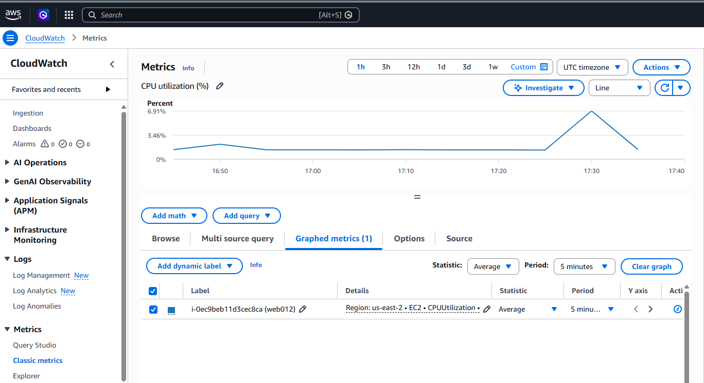
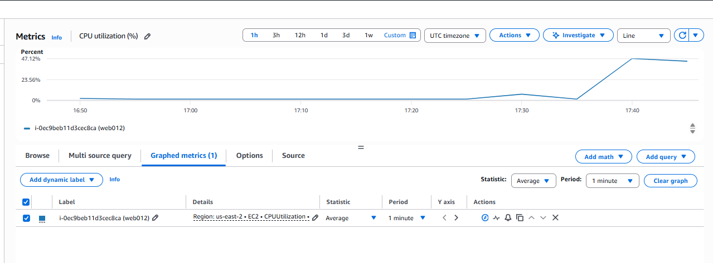
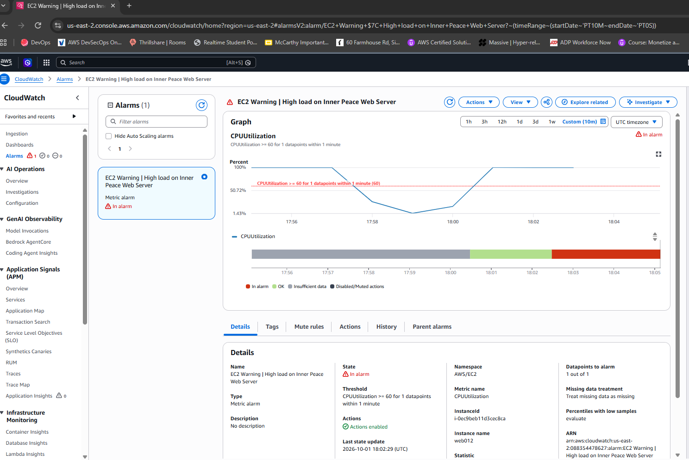

# AWS Cloud Watch

AWS Cloudwatch is a monitoring service, also expanded as a Login and events solution  








## What we do with the metrics:







## Cloudwtach Monitoring

- Creatin g EC2 instance from exixting launch template

```sh
[root@ip-172-31-40-208 ec2-user]# cat /etc/os-release
NAME="Amazon Linux"
VERSION="2023"
ID="amzn"
ID_LIKE="fedora"
VERSION_ID="2023"
PLATFORM_ID="platform:al2023"
PRETTY_NAME="Amazon Linux 2023.12.20260930"
ANSI_COLOR="0;33"
CPE_NAME="cpe:2.3:o:amazon:amazon_linux:2023"
HOME_URL="https://aws.amazon.com/linux/amazon-linux-2023/"
DOCUMENTATION_URL="https://docs.aws.amazon.com/linux/"
SUPPORT_URL="https://aws.amazon.com/premiumsupport/"
BUG_REPORT_URL="https://github.com/amazonlinux/amazon-linux-2023"
VENDOR_NAME="AWS"
VENDOR_URL="https://aws.amazon.com/"
SUPPORT_END="2029-06-30"
```

## Install stress

> What is stress?

stress is a command-line tool that intentionally puts load on your system to test its stability, performance, and resource limits. It can create heavy usage of:
- CPU
- Memory (RAM)
- Disk I/O
- Storage operations

> System administrators and developers use it to:

- Benchmark systems
- Test cooling and power systems
- Verify server stability under load
- Reproduce performance problems

```sh
[root@ip-172-31-40-208 ec2-user]# dnf install stress -y
```

```sh
[root@ip-172-31-40-208 ec2-user]# stress
`stress' imposes certain types of compute stress on your system

Usage: stress [OPTION [ARG]] ...
 -?, --help         show this help statement
     --version      show version statement
 -v, --verbose      be verbose
 -q, --quiet        be quiet
 -n, --dry-run      show what would have been done
 -t, --timeout N    timeout after N seconds
     --backoff N    wait factor of N microseconds before work starts
 -c, --cpu N        spawn N workers spinning on sqrt()
 -i, --io N         spawn N workers spinning on sync()
 -m, --vm N         spawn N workers spinning on malloc()/free()
     --vm-bytes B   malloc B bytes per vm worker (default is 256MB)
     --vm-stride B  touch a byte every B bytes (default is 4096)
     --vm-hang N    sleep N secs before free (default none, 0 is inf)
     --vm-keep      redirty memory instead of freeing and reallocating
 -d, --hdd N        spawn N workers spinning on write()/unlink()
     --hdd-bytes B  write B bytes per hdd worker (default is 1GB)
Example: stress --cpu 8 --io 4 --vm 2 --vm-bytes 128M --timeout 10s
Note: Numbers may be suffixed with s,m,h,d,y (time) or B,K,M,G (size).
```

```sh
[root@ip-172-31-40-208 ec2-user]# stress -c 4 -t 5
stress: info: [10040] dispatching hogs: 4 cpu, 0 io, 0 vm, 0 hdd
stress: info: [10040] successful run completed in 5s
```

> Copilot
```
Give m,e a bash script to run below command for random intervals for random amount of time. Just make ir runs more than 1 minute everytime.
stress -c 4 -t 5
```

```sh
#!/bin/bash

while true; do
    # Random stress duration: 61-300 seconds
    stress_time=$((RANDOM % 240 + 61))

    # Random sleep interval: 30-180 seconds
    sleep_time=$((RANDOM % 151 + 30))

    echo "$(date) - Running stress for ${stress_time}s"
    echo "$(date) - Starting process: stress -c 4 -t ${stress_time} (PID: $$)"
    stress -c 11 -t "$stress_time"

    echo "$(date) - Sleeping for ${sleep_time}s"
    sleep "$sleep_time"
done
```

> Run it in the background

```sh
[root@ip-172-31-40-208 ec2-user]# nohup ./a02_Stress.sh &
```

```sh
top - 17:43:33 up  2:30,  2 users,  load average: 6.07, 1.94, 0.72
Tasks: 125 total,  12 running, 113 sleeping,   0 stopped,   0 zombie
%Cpu(s):100.0 us,  0.0 sy,  0.0 ni,  0.0 id,  0.0 wa,  0.0 hi,  0.0 si,  0.0 st
MiB Mem :    957.7 total,    474.8 free,    187.2 used,    295.7 buff/cache
MiB Swap:      0.0 total,      0.0 free,      0.0 used.    630.1 avail Mem

    PID USER      PR  NI    VIRT    RES    SHR S  %CPU  %MEM     TIME+ COMMAND
  10581 root      20   0    3544    504    392 R   9.5   0.1   0:04.21 stress
  10572 root      20   0    3544    504    392 R   9.2   0.1   0:04.20 stress
  10576 root      20   0    3544    504    392 R   9.2   0.1   0:04.20 stress
  10577 root      20   0    3544    504    392 R   9.2   0.1   0:04.20 stress
  10579 root      20   0    3544    504    392 R   9.2   0.1   0:04.20 stress
  10580 root      20   0    3544    504    392 R   9.2   0.1   0:04.20 stress
  10582 root      20   0    3544    504    392 R   9.2   0.1   0:04.21 stress
  10573 root      20   0    3544    504    392 R   8.9   0.1   0:04.19 stress
  10574 root      20   0    3544    504    392 R   8.9   0.1   0:04.19 stress
  10575 root      20   0    3544    504    392 R   8.9   0.1   0:04.19 stress
  10578 root      20   0    3544    504    392 R   8.9   0.1   0:04.18 stress
  10586 root      20   0  224080   3532   2820 R   0.3   0.4   0:00.03 top
      1 root      20   0  108384  17840  11212 S   0.0   1.8   0:01.48 systemd
      2 root      20   0       0      0      0 S   0.0   0.0   0:00.00 kthreadd
      3 root      20   0       0      0      0 S   0.0   0.0   0:00.00 pool_workqueue_release
      4 root       0 -20       0      0      0 I   0.0   0.0   0:00.00 kworker/R-rcu_gp
      5 root       0 -20       0      0      0 I   0.0   0.0   0:00.00 kworker/R-sync_wq
      6 root       0 -20       0      0      0 I   0.0   0.0   0:00.00 kworker/R-kvfree_rcu_reclaim
      7 root       0 -20       0      0      0 I   0.0   0.0   0:00.00 kworker/R-slub_flushwq
      8 root       0 -20       0      0      0 I   0.0   0.0   0:00.00 kworker/R-netns
     10 root       0 -20       0      0      0 I   0.0   0.0   0:00.00 kworker/0:0H-events_highpri
     13 root       0 -20       0      0      0 I   0.0   0.0   0:00.00 kworker/R-mm_percpu_wq
     14 root      20   0       0      0      0 S   0.0   0.0   0:00.09 ksoftirqd/0
     15 root      20   0       0      0      0 I   0.0   0.0   0:00.09 rcu_preempt
     16 root      20   0       0      0      0 S   0.0   0.0   0:00.00 rcu_exp_par_gp_kthread_worker/0

```







```sh
[root@ip-172-31-40-208 ec2-user]# ps -ef | grep a02_Stress.sh
root       10568    7777  0 17:42 pts/1    00:00:00 /bin/bash ./a02_Stress.sh
root       11529    7777  0 18:01 pts/1    00:00:00 grep --color=auto a02_Stress.sh

[root@ip-172-31-40-208 ec2-user]# kill 10568

[1]+  Terminated              nohup ./a02_Stress.sh

[root@ip-172-31-40-208 ec2-user]# ps -ef | grep a02_Stress.sh
root       11588    7777  0 18:01 pts/1    00:00:00 grep --color=auto a02_Stress.sh
```




