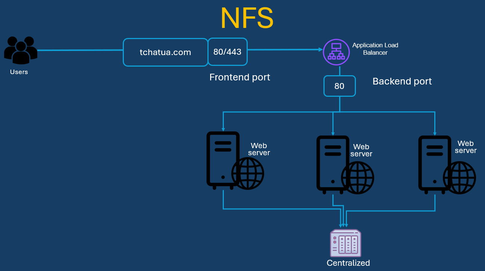
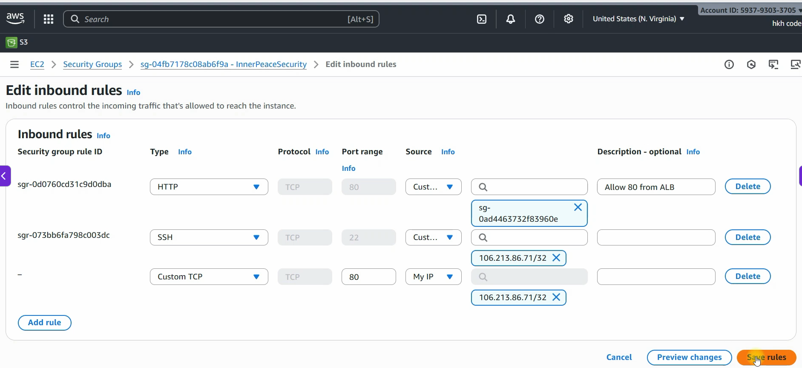
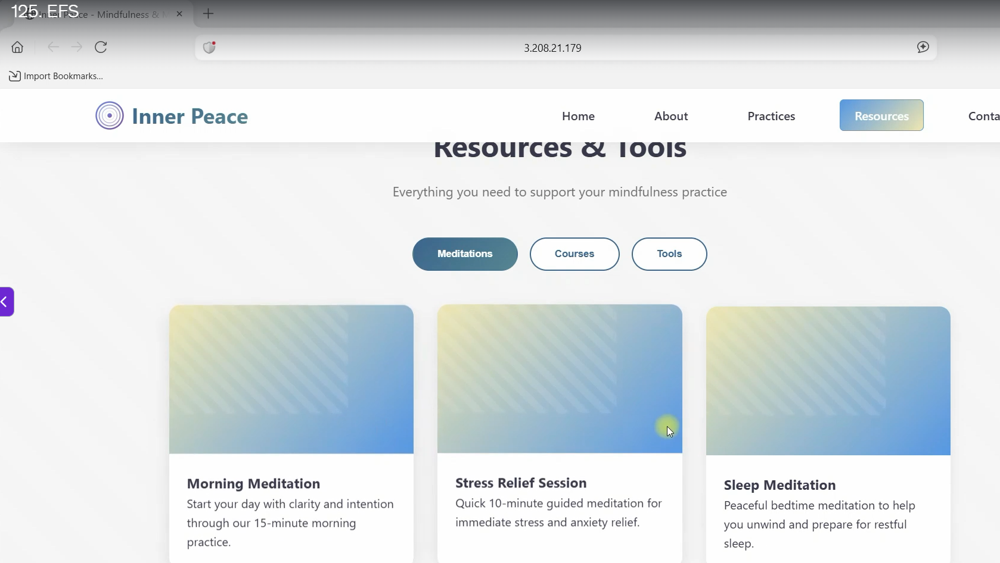
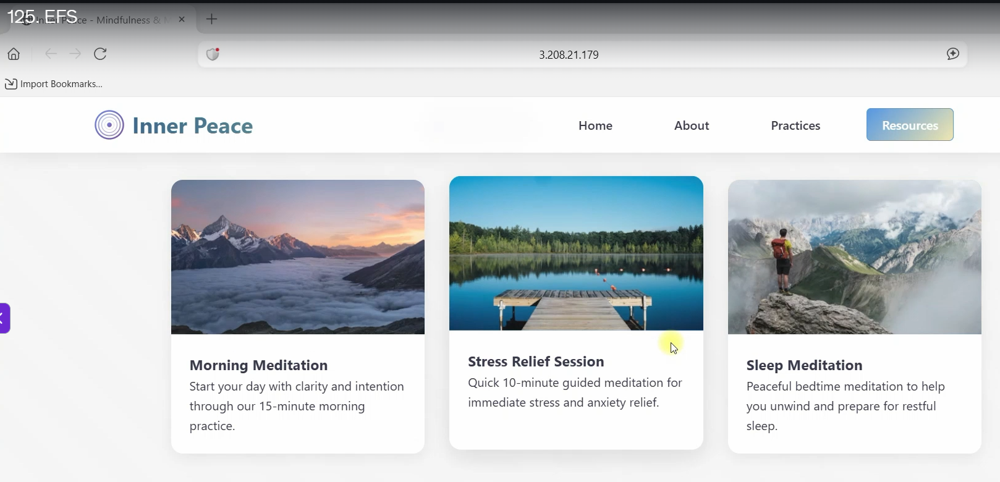
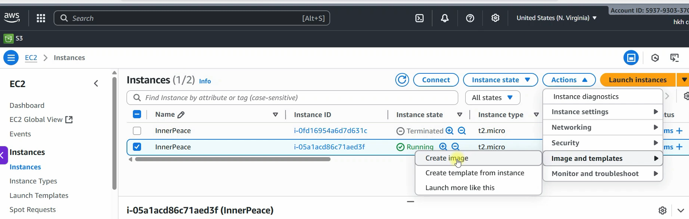
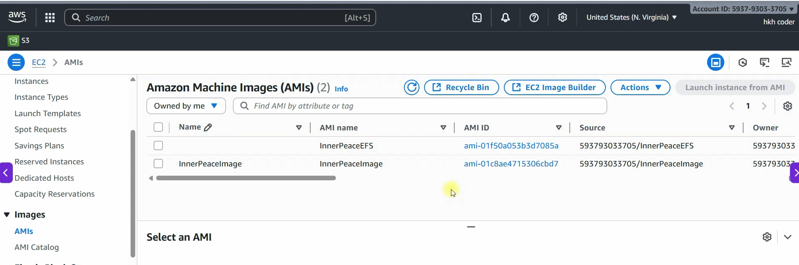

# Amazon Elastic File System: EFS

Amazon EFS is a scalable, elastic, cloud-native NFS file system

Amazon Elastic File System (Amazon EFS) provides a simple, scalable, fully managed elastic NFS file system for use with AWS Cloud services and on-premises resources. 
It is built to scale on demand to petabytes without disrupting applications, growing and shrinking automatically as you add and remove files, eliminating the need to provision and manage capacity to accommodate growth. 
Amazon EFS is designed to provide massively parallel shared access to thousands of Amazon EC2 instances, enabling your applications to achieve high levels of aggregate throughput and IOPS with consistent low latencies.

## URLs

- https://docs.aws.amazon.com/efs/latest/ug/installing-amazon-efs-utils.html



## Create security grooup for NFS
## Create EC2 instance from the existing Launch Template

```sh
[root@ip-172-31-38-145 ec2-user]# ll /var/www/html/
total 64
-rw-r--r--. 1 root root   453 Oct  1 01:34 'ABOUT THIS TEMPLATE.txt'
drwxr-xr-x. 2 root root   161 Oct  1 01:34  css
drwxr-xr-x. 2 root root   187 Oct  1 01:34  fonts
drwxr-xr-x. 2 root root 16384 Oct  1 01:34  images
-rw-r--r--. 1 root root 24712 Oct  1 01:34  index.html
drwxr-xr-x. 2 root root   185 Oct  1 01:34  js
-rw-r--r--. 1 root root 14792 Oct  1 01:34  news-detail.html

[root@ip-172-31-38-145 ec2-user]# ll /var/www/html/images/
total 868
-rw-r--r--. 1 root root 121941 Oct  1 01:34 about-bg.jpg
-rw-r--r--. 1 root root 110548 Oct  1 01:34 appointment-image.jpg
-rw-r--r--. 1 root root   8754 Oct  1 01:34 author-image.jpg
-rw-r--r--. 1 root root  17255 Oct  1 01:34 news-image.jpg
-rw-r--r--. 1 root root  46162 Oct  1 01:34 news-image1.jpg
-rw-r--r--. 1 root root  48078 Oct  1 01:34 news-image2.jpg
-rw-r--r--. 1 root root  52478 Oct  1 01:34 news-image3.jpg
-rw-r--r--. 1 root root  83969 Oct  1 01:34 slider1.jpg
-rw-r--r--. 1 root root 101358 Oct  1 01:34 slider2.jpg
-rw-r--r--. 1 root root 151979 Oct  1 01:34 slider3.jpg
-rw-r--r--. 1 root root  44974 Oct  1 01:34 team-image1.jpg
-rw-r--r--. 1 root root  39904 Oct  1 01:34 team-image2.jpg
-rw-r--r--. 1 root root  39419 Oct  1 01:34 team-image3.jpg

[root@ip-172-31-38-145 images]# mkdir /tmp/images

[root@ip-172-31-38-145 images]# mv /var/www/html/images/* /tmp/images/

[root@ip-172-31-38-145 images]# systemctl restart httpd
```

## Create NFS

```sh
Navigate to AWS Console and search `EFS`
└── Create file system
    ├── Name - optional
    │   └── InnerPeace-Images
    ├── `Customize`
    │   ├── File system type
    │   │   └── Regional
    │   ├── Automatic backup
    │   │   └── Check mark it
    │   ├── Lifecycle management 
    │   │   ├── Transition into frequent access (IA) > 30 days
    │   │   ├── Transition into archive > None
    │   │   ├── Transition into standard > None
    │   │   └── 
    │   ├── Encryprion at rest 
    │   │   └── Check mark it
    │   ├── Performance settings
    │   │   └── Throuput mode
    │   │       └── Bursting
    │   ├── Tags
    │   │   ├── Tag key: Name
    │   │   └── Tage value: InnerPeace-Images
    ├── Network
    │   ├── VPC
    │   │   └── Choose the require one
    │   ├── Mount targets
    │   │   └── make sure to choose the right Security Group for each AZ
    │   └── Next
    │    
    ├── Next 
    └── Create
```

## Connect instances to the EFS using the access point

```sh
Go to EAF > Access point
└── Create access point
    ├── Details
    │   └── File system > Choose the file system
    └── Create access point

Go to launch template
└── Create launch template

```
$ ssh -i "DecodingDevOps.pem" ec2-user@ec2-77-113-45-34.us-east-2.compute.amazonaws.com
The authenticity of host 'ec2-77-113-45-34.us-east-2.compute.amazonaws.com (77.113.45.34)' can't be established.
ED25519 key fingerprint is: SHA256:l9DA9uGb11YfzWsnAl8t3pxZ6SpdVM+fZ9jmoXlaQ1g
This key is not known by any other names.
Are you sure you want to continue connecting (yes/no/[fingerprint])? yes
Warning: Permanently added 'ec2-77-113-45-34.us-east-2.compute.amazonaws.com' (ED25519) to the list of known hosts.
** WARNING: connection is not using a post-quantum key exchange algorithm.
** This session may be vulnerable to "store now, decrypt later" attacks.
** The server may need to be upgraded. See https://openssh.com/pq.html
   ,     #_
   ~\_  ####_        Amazon Linux 2023
  ~~  \_#####\
  ~~     \###|
  ~~       \#/ ___   https://aws.amazon.com/linux/amazon-linux-2023
   ~~       V~' '->
    ~~~         /
      ~~._.   _/
         _/ _/
       _/m/'
Last login: Thu Oct  1 01:33:12 2026 from 138.89.63.208

[ec2-user@ip-172-31-32-206 ~]$ sudo -i

[root@ip-172-31-32-206 ~]#
```sh

```

## Mount file system manually

```sh
[root@ip-172-31-32-206 ~]# ls -al /var/www/html/
total 64
drwxr-xr-x. 6 root root   127 Oct  1 01:34  .
drwxr-xr-x. 4 root root    33 Oct  1 01:34  ..
-rw-r--r--. 1 root root   453 Oct  1 01:34 'ABOUT THIS TEMPLATE.txt'
drwxr-xr-x. 2 root root   161 Oct  1 01:34  css
drwxr-xr-x. 2 root root   187 Oct  1 01:34  fonts
drwxr-xr-x. 2 root root 16384 Oct  1 01:34  images
-rw-r--r--. 1 root root 24712 Oct  1 01:34  index.html
drwxr-xr-x. 2 root root   185 Oct  1 01:34  js
-rw-r--r--. 1 root root 14792 Oct  1 01:34  news-detail.html
```




## Moves images in the temporary space to use **/var/www/html/images** as a mount point

```sh
[root@ip-172-31-32-206 ~]# mkdir /tmp/images

[root@ip-172-31-32-206 ~]# mv /var/www/html/images/* /tmp/images/

[root@ip-172-31-32-206 ~]# ls -al /tmp/images/
total 868
drwxr-xr-x.  2 root root    300 Oct  2 10:32 .
drwxrwxrwt. 13 root root    260 Oct  2 10:32 ..
-rw-r--r--.  1 root root 121941 Oct  1 01:34 about-bg.jpg
-rw-r--r--.  1 root root 110548 Oct  1 01:34 appointment-image.jpg
-rw-r--r--.  1 root root   8754 Oct  1 01:34 author-image.jpg
-rw-r--r--.  1 root root  17255 Oct  1 01:34 news-image.jpg
-rw-r--r--.  1 root root  46162 Oct  1 01:34 news-image1.jpg
-rw-r--r--.  1 root root  48078 Oct  1 01:34 news-image2.jpg
-rw-r--r--.  1 root root  52478 Oct  1 01:34 news-image3.jpg
-rw-r--r--.  1 root root  83969 Oct  1 01:34 slider1.jpg
-rw-r--r--.  1 root root 101358 Oct  1 01:34 slider2.jpg
-rw-r--r--.  1 root root 151979 Oct  1 01:34 slider3.jpg
-rw-r--r--.  1 root root  44974 Oct  1 01:34 team-image1.jpg
-rw-r--r--.  1 root root  39904 Oct  1 01:34 team-image2.jpg
-rw-r--r--.  1 root root  39419 Oct  1 01:34 team-image3.jpg

[root@ip-172-31-32-206 ~]# ls -al /var/www/html/images/
total 0
drwxr-xr-x. 2 root root   6 Oct  2 10:32 .
drwxr-xr-x. 6 root root 127 Oct  1 01:34 ..
```

## Restart httpd service

```sh
[root@ip-172-31-32-206 ~]# systemctl restart httpd
```




## Installing efs client(utils) on my webserver

```sh
[root@ip-172-31-32-206 ~]# sudo yum install -y amazon-efs-utils
```

- https://docs.aws.amazon.com/efs/latest/ug/mount-fs-auto-mount-update-fstab.html

> To automatically mount a file system using an EFS access point, add the following line to the /etc/fstab file.

```
file-system-id:/ efs-mount-point efs _netdev,noresvport,tls,accesspoint=access-point-id 0 0

fs-08b57d8bdaf76ada4:/ /var/www/html/images/ efs _netdev,noresvport,tls,accesspoint=fsap-0cd724bd7b8d6eaa0 0 0
```

> [root@ip-172-31-32-206 ~]# vim /etc/fstab
```sh
#
UUID=13620258-e244-47c2-abcf-abbd3512c293     /           xfs    defaults,noatime  1   1
UUID=9991-F753        /boot/efi       vfat    defaults,noatime,uid=0,gid=0,umask=0077,shortname=winnt,x-systemd.automount 0 2
# Added:
fs-08b57d8bdaf76ada4:/ /var/www/html/images/ efs _netdev,noresvport,tls,accesspoint=fsap-0cd724bd7b8d6eaa0 0 0
```

## mount the EFS

```sh
[root@ip-172-31-32-206 ~]# df -h
Filesystem      Size  Used Avail Use% Mounted on
devtmpfs        4.0M     0  4.0M   0% /dev
tmpfs           479M     0  479M   0% /dev/shm
tmpfs           192M  2.9M  189M   2% /run
/dev/xvda1      8.0G  1.7G  6.3G  22% /
tmpfs           479M  868K  479M   1% /tmp
/dev/xvda128     10M  1.3M  8.7M  13% /boot/efi
tmpfs            96M     0   96M   0% /run/user/1000

[root@ip-172-31-32-206 ~]# mount -a

[root@ip-172-31-32-206 ~]# df -h
Filesystem      Size  Used Avail Use% Mounted on
devtmpfs        4.0M     0  4.0M   0% /dev
tmpfs           479M     0  479M   0% /dev/shm
tmpfs           192M  2.9M  189M   2% /run
/dev/xvda1      8.0G  1.7G  6.3G  22% /
tmpfs           479M  868K  479M   1% /tmp
/dev/xvda128     10M  1.3M  8.7M  13% /boot/efi
tmpfs            96M     0   96M   0% /run/user/1000
127.0.0.1:/     8.0E     0  8.0E   0% /var/www/html/images
```

## Bring back images

```sh
[root@ip-172-31-32-206 ~]# mv /tmp/images/* /var/www/html/images/

[root@ip-172-31-32-206 ~]# ls -al /var/www/html/images/
total 872
drwxr-xr-x. 2 root root   6144 Oct  2 10:54 .
drwxr-xr-x. 6 root root    127 Oct  1 01:34 ..
-rw-r--r--. 1 root root 121941 Oct  1 01:34 about-bg.jpg
-rw-r--r--. 1 root root 110548 Oct  1 01:34 appointment-image.jpg
-rw-r--r--. 1 root root   8754 Oct  1 01:34 author-image.jpg
-rw-r--r--. 1 root root  17255 Oct  1 01:34 news-image.jpg
-rw-r--r--. 1 root root  46162 Oct  1 01:34 news-image1.jpg
-rw-r--r--. 1 root root  48078 Oct  1 01:34 news-image2.jpg
-rw-r--r--. 1 root root  52478 Oct  1 01:34 news-image3.jpg
-rw-r--r--. 1 root root  83969 Oct  1 01:34 slider1.jpg
-rw-r--r--. 1 root root 101358 Oct  1 01:34 slider2.jpg
-rw-r--r--. 1 root root 151979 Oct  1 01:34 slider3.jpg
-rw-r--r--. 1 root root  44974 Oct  1 01:34 team-image1.jpg
-rw-r--r--. 1 root root  39904 Oct  1 01:34 team-image2.jpg
-rw-r--r--. 1 root root  39419 Oct  1 01:34 team-image3.jpg

[root@ip-172-31-32-206 ~]# systemctl restart httpd

```





## Create AMI image of this instance to set it as golden AMI






